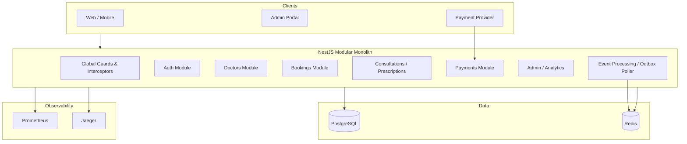
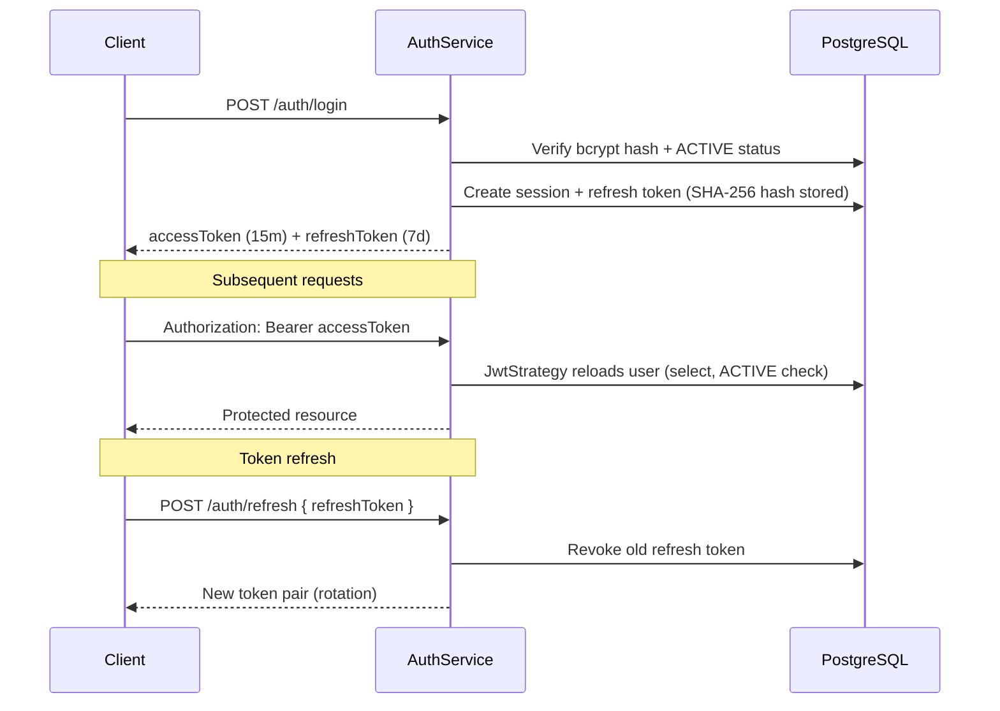
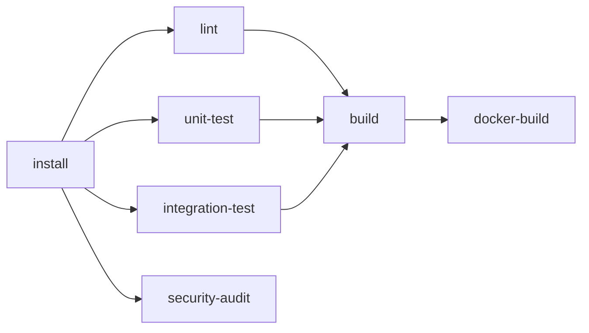

# Amrutam Telemedicine Backend

[](https://github.com/amrutam/amrutam-backend/actions/workflows/ci.yml)
[](package.json)
[](package.json)
[](docs/openapi.yaml)

> Production-grade NestJS API for an Ayurveda telemedicine platform — auth, doctor discovery, booking, clinical workflows, payments, and admin analytics. Built as a **modular monolith** with correctness under concurrency as the primary design constraint.

**Reviewing this submission?** Start with [docs/REVIEWER_GUIDE.md](docs/REVIEWER_GUIDE.md) → [docs/ARCHITECTURE.md](docs/ARCHITECTURE.md) → `create-booking.service.ts`.

---

## 1. Project Overview

The Amrutam Telemedicine Backend is a REST API that powers an end-to-end Ayurveda telemedicine platform. It handles patient registration and authentication, doctor discovery with cached search, appointment booking with idempotency and optimistic locking, consultation lifecycle management, immutable prescription versioning, payment processing with webhooks, async notifications via a transactional outbox, and admin dashboards with audit trails.

The system is designed to support **100,000+ consultations per day** while guaranteeing that two patients cannot book the same slot and that network retries do not create duplicate bookings.

| Attribute | Value |
|-----------|-------|
| **Architecture** | Modular monolith (NestJS 10) |
| **Database** | PostgreSQL 16 + Prisma (39 models) |
| **Cache / Queue** | Redis 7 + BullMQ |
| **API prefix** | `/api/v1` |
| **Interactive docs** | http://localhost:3000/docs |
| **Canonical OpenAPI** | [docs/openapi.yaml](docs/openapi.yaml) |

---

## 2. Assignment Objective

This repository fulfills a **Senior Backend Engineer assignment** to design and implement a production-ready telemedicine API. The evaluation criteria map to:

| Objective | Implementation |
|-----------|----------------|
| Correctness under concurrency | Optimistic locking on slots, idempotency keys, DB transactions |
| Reliable side effects | Transactional outbox → BullMQ workers with DLQ |
| Clean architecture | Per-module `presentation/` / `application/` / `infrastructure/` / `domain/` |
| Security | JWT + RBAC, bcrypt, audit logs, PHI masking |
| Observability | Structured logs, Prometheus metrics, OpenTelemetry traces |
| Operability | Health probes, graceful shutdown, Docker, Kubernetes, CI |
| Documentation | ADRs, architecture guide, OpenAPI 3.1 spec, reviewer guide |

Compliance traceability: [docs/ASSIGNMENT_COMPLIANCE.md](docs/ASSIGNMENT_COMPLIANCE.md) (~87% overall completion).

---

## 3. Key Features

| Domain | Capabilities |
|--------|-------------|
| **Auth** | Register, login, refresh token rotation, logout, profile (`/auth/*`) |
| **Doctors** | Cached search, profiles, slot listing, slot/leave management |
| **Booking** | Idempotent `POST /appointments`, optimistic slot locking, cancel/reschedule |
| **Clinical** | Consultation state machine, versioned clinical notes |
| **Prescriptions** | Append-only immutable version history |
| **Payments** | Provider adapter (Mock/Razorpay skeleton), webhooks, refunds |
| **Notifications** | Async delivery via outbox + BullMQ |
| **Admin** | Dashboard, analytics, global search, audit log, system health |
| **Platform** | Liveness/readiness probes, Prometheus, OTEL, graceful shutdown |

---

## 4. Tech Stack

| Category | Technology | Rationale |
|----------|------------|-----------|
| Runtime | Node.js 20, TypeScript 5 | Type safety + ecosystem |
| Framework | NestJS 10 | DI, guards, modular structure |
| ORM | Prisma 6 | Type-safe migrations, 39 models |
| Database | PostgreSQL 16 | ACID transactions for booking |
| Cache | Redis 7 | Cache-aside + BullMQ backend |
| Queue | BullMQ 5 | Retry, backoff, dead-letter queue |
| Auth | JWT + Passport, bcrypt | Stateless horizontal scaling |
| API docs | Swagger UI + OpenAPI 3.1 YAML | Interactive + canonical spec |
| Logging | Winston (JSON) | Structured, PHI-masked logs |
| Metrics | Prometheus (`prom-client`) | HTTP, DB, Redis, cache, queue |
| Tracing | OpenTelemetry → OTLP → Jaeger | Distributed request tracing |
| Testing | Jest, Supertest, k6 | Unit, integration, load |
| Infra | Docker, Kubernetes, Terraform skeleton | Production deployment path |

---

## 5. High-Level Architecture



| Layer | Responsibility | Example |
|-------|----------------|---------|
| **Presentation** | HTTP, DTO validation, Swagger | `appointments.controller.ts` |
| **Application** | Use cases, orchestration | `create-booking.service.ts` |
| **Infrastructure** | Prisma, Redis, adapters | `slot.repository.ts` |
| **Domain** | State machines, invariants | `appointment-status.enum.ts` |

Deep dive: [docs/ARCHITECTURE.md](docs/ARCHITECTURE.md) · Diagrams: [docs/diagrams.md](docs/diagrams.md) · ADRs: [docs/adr/](docs/adr/)

---

## 6. Folder Structure

```
amrutam-backend/
├── src/
│   ├── modules/
│   │   ├── auth/                 # Register, login, refresh, profile
│   │   ├── doctors/              # Search (cached), slots, leaves
│   │   ├── bookings/             # ★ Reference module — start here
│   │   ├── consultations/        # Clinical lifecycle + notes
│   │   ├── prescriptions/        # Immutable versioning
│   │   ├── payments/             # Provider adapter pattern
│   │   ├── notifications/        # Async consumers
│   │   ├── admin/                # Dashboard, analytics, audit
│   │   ├── analytics/            # Reporting services
│   │   ├── audit/                # Immutable audit trail
│   │   ├── search/               # Global admin search
│   │   ├── rbac/                 # Roles guard
│   │   └── event-processing/     # Outbox poller + DLQ
│   ├── events/                   # Outbox write side
│   ├── common/                   # Cache, decorators, exceptions, utils
│   ├── config/                   # Env validation (Joi)
│   ├── database/                 # Prisma + Redis services
│   ├── health/ metrics/ telemetry/ shutdown/
│   ├── logger/ queues/
│   ├── app.module.ts
│   └── main.ts
├── prisma/                       # Schema (39 models), migrations, seed
├── test/                         # Unit + integration tests
├── loadtests/                    # k6 scenarios
├── docker/                       # Dockerfile + Compose
├── infra/k8s/ infra/terraform/   # Deployment manifests
├── docs/                         # Architecture, OpenAPI, guides, ADRs
├── scripts/                      # Setup, tokens, CI helpers
└── .github/workflows/            # CI pipeline
```

---

## 7. Local Setup

### Prerequisites

- Node.js 20+
- Docker Desktop (for Postgres, Redis, observability stack)
- npm 9+

### One-command setup

```bash
git clone https://github.com/amrutam/amrutam-backend.git
cd amrutam-backend
npm run setup          # Creates .env, installs deps, starts infra, runs migrations
npm run prisma:seed    # Seeds test users, doctors, slots
npm run start:dev      # API at http://localhost:3000
```

### Seed users

| Role | Email | Password |
|------|-------|----------|
| Patient | patient@amrutam.test | Password123! |
| Doctor | doctor@amrutam.test | Password123! |
| Admin | admin@amrutam.test | Password123! |

---

## 8. Docker Setup

### Infrastructure only (recommended for development)

```bash
docker compose -f docker/docker-compose.yml up -d postgres redis prometheus grafana jaeger
npm run start:dev
```

### Full stack in Docker

```bash
docker compose -f docker/docker-compose.yml up -d --build
```

### Dev overlay (hot reload)

```bash
npm run docker:dev
```

### Tear down

```bash
npm run docker:down
```

| Service | URL |
|---------|-----|
| API / Swagger | http://localhost:3000 · http://localhost:3000/docs |
| Prometheus | http://localhost:9090 |
| Grafana | http://localhost:3001 |
| Jaeger | http://localhost:16686 |

The multi-stage `docker/Dockerfile` runs as non-root, includes a healthcheck on `/api/v1/health/ready`, and uses `STOPSIGNAL SIGTERM` for graceful shutdown.

---

## 9. Environment Variables

Copy [`.env.example`](.env.example) to `.env`. Production boot fails on weak secrets via `src/config/env.validation.ts`.

| Variable | Purpose | Default |
|----------|---------|---------|
| `NODE_ENV` | Runtime environment | `development` |
| `PORT` | HTTP port | `3000` |
| `API_PREFIX` | Global route prefix | `api/v1` |
| `DATABASE_URL` | PostgreSQL connection string | Local Docker Postgres |
| `REDIS_HOST` / `REDIS_PORT` | Redis for cache + BullMQ | `localhost:6379` |
| `JWT_ACCESS_SECRET` | Access token signing (32+ chars) | — |
| `JWT_REFRESH_SECRET` | Refresh token signing (32+ chars) | — |
| `JWT_ACCESS_EXPIRES_IN` | Access token TTL | `15m` |
| `JWT_REFRESH_EXPIRES_IN` | Refresh token TTL | `7d` |
| `BCRYPT_ROUNDS` | Password hashing cost | `12` |
| `THROTTLE_LIMIT` / `THROTTLE_TTL` | Rate limiting | `100` / `60000` |
| `CORS_ORIGINS` | Allowed origins (comma-separated) | `localhost:3000,4200` |
| `SWAGGER_ENABLED` | Swagger UI toggle | `true` |
| `PAYMENT_PROVIDER` | `MOCK` or `RAZORPAY` | `MOCK` |
| `PAYMENT_WEBHOOK_SECRET` | HMAC webhook verification | — |
| `OTEL_ENABLED` | OpenTelemetry tracing | `true` |
| `OTEL_EXPORTER_OTLP_ENDPOINT` | Jaeger OTLP endpoint | `http://localhost:4318/v1/traces` |
| `CACHE_DEFAULT_TTL_SECONDS` | Default Redis cache TTL | `60` |
| `SLOW_REQUEST_THRESHOLD_MS` | Slow request log threshold | `1000` |

---

## 10. Running the Project

```bash
# Development (hot reload)
npm run start:dev

# Production build
npm run build
npm run start:prod

# Generate Prisma client after schema changes
npm run prisma:generate

# Apply migrations (development)
npm run prisma:migrate

# Apply migrations (production)
npm run prisma:deploy
```

### Quick API smoke test

```bash
# Login
curl -s -X POST http://localhost:3000/api/v1/auth/login \
  -H "Content-Type: application/json" \
  -d '{"email":"patient@amrutam.test","password":"Password123!"}'

# Search doctors (public)
curl "http://localhost:3000/api/v1/doctors?keyword=ayurveda"

# Health readiness
curl http://localhost:3000/api/v1/health/ready
```

### Dev token shortcuts

```bash
npm run token:patient
npm run token:doctor
npm run token:admin
```

---

## 11. Running Tests

```bash
# Unit tests (43 tests — booking, idempotency, guards, state machines)
npm test

# Unit tests with coverage (17% threshold)
npm run test:cov

# Integration tests (requires Postgres + Redis)
npm run test:integration

# Full local CI mirror
npm run ci:local
```

| Layer | Location | Focus |
|-------|----------|-------|
| Unit | `test/unit/*.spec.ts` | Business logic, domain rules |
| Integration | `test/integration/*.integration.spec.ts` | Auth, doctors, health HTTP flows |

Integration specs are excluded from `npm test` via `testRegex` — CI runs them separately with service containers.

---

## 12. Running Load Tests

Requires [k6](https://k6.io/) installed locally. API must be running with seeded data.

```bash
npm run loadtest:smoke     # Quick smoke (low VUs)
npm run loadtest:normal    # Steady-state workload
npm run loadtest:peak      # Peak traffic simulation
```

Additional scenarios in `loadtests/scenarios/`: `stress.js`, `spike.js`, `soak.js`.

Workloads authenticate via real `POST /auth/login` and exercise `/doctors`, slot listing, and health endpoints — see `loadtests/workloads.js`.

**Targets:** read p95 < 200ms · write p95 < 500ms · 100K consultations/day capacity plan in [docs/SCALING_PLAN.md](docs/SCALING_PLAN.md).

---

## 13. Swagger / OpenAPI Documentation

| Resource | URL / Path |
|----------|------------|
| **Swagger UI** (interactive) | http://localhost:3000/docs |
| **Runtime JSON** | http://localhost:3000/docs/json |
| **Runtime YAML** | http://localhost:3000/docs/yaml |
| **Canonical OpenAPI 3.1** | [docs/openapi.yaml](docs/openapi.yaml) |

All API responses use a standard envelope:

```json
{
  "success": true,
  "data": {},
  "meta": {},
  "requestId": "550e8400-e29b-41d4-a716-446655440000",
  "timestamp": "2026-07-10T12:00:00.000Z"
}
```

Errors return `{ success: false, code, message, details, requestId, timestamp }` with stable `ErrorCode` values.

Authorize in Swagger UI: **Authorize** → `Bearer <accessToken>` from `POST /api/v1/auth/login`.

---

## 14. Authentication Flow



| Endpoint | Auth | Description |
|----------|------|-------------|
| `POST /auth/register` | Public | Patient registration |
| `POST /auth/login` | Public | Issue access + refresh tokens |
| `POST /auth/refresh` | Public | Rotate refresh token |
| `POST /auth/logout` | Bearer | Revoke refresh token |
| `GET/PATCH /auth/me` | Bearer | Profile read/update |

**Guards:** Global `JwtAuthGuard` (bypass via `@Public()`) → `RolesGuard` (where applied) → service-level ownership checks.

Implementation: [`auth.service.ts`](src/modules/auth/application/services/auth.service.ts) · [ADR-007](docs/adr/007-jwt-authentication.md)

---

## 15. Business Modules

| Module | Key Endpoints | Pattern |
|--------|---------------|---------|
| **Doctors** | `GET /doctors`, `GET /doctors/:id/slots` | Cache-aside search (60s TTL) |
| **Bookings** | `POST /appointments` + `Idempotency-Key` | Transaction + optimistic lock + outbox |
| **Consultations** | `POST /consultations/:id/start\|complete` | Finite state machine |
| **Prescriptions** | `PATCH /prescriptions/:id` | Append-only versions |
| **Payments** | `POST /payments/initiate`, `/webhook` | Provider adapter + HMAC |
| **Notifications** | `GET /notifications` | Outbox → BullMQ delivery |
| **Admin** | `GET /admin/dashboard` | Redis-cached aggregates |

**46 HTTP endpoints** across 10 controllers. Full specification: [docs/openapi.yaml](docs/openapi.yaml).

---

## 16. Performance Optimizations

| Optimization | Location | Impact |
|--------------|----------|--------|
| Optimistic locking (not pessimistic `FOR UPDATE`) | `slot.repository.ts` | Higher throughput, no deadlocks |
| JWT validation `select` (not full `include`) | `jwt.strategy.ts` | Reduced DB payload per request |
| List queries explicit `select` | `appointment.repository.ts` | Narrower result sets |
| Dashboard date-bounded parallel counts | `dashboard.service.ts` | Avoids full-table scans |
| Doctor search cache-aside (60s) + stampede lock | `cache.service.ts` | Protects DB under search spikes |
| pg_trgm GIN indexes for ILIKE search | Performance migration | Sub-linear text search |
| Partial index on `outbox_events` PENDING | Performance migration | Faster poller queries |
| Cache hit/miss Prometheus counters | `metrics.service.ts` | Observable cache effectiveness |
| Connection pool limit | `DATABASE_URL` | `connection_limit=20` |

Reports: [docs/performance/BENCHMARK_REPORT.md](docs/performance/BENCHMARK_REPORT.md) · [docs/performance/QUERY_OPTIMIZATION.md](docs/performance/QUERY_OPTIMIZATION.md)

---

## 17. Security Features

| Control | Implementation |
|---------|----------------|
| Transport / headers | Helmet, CORS allowlist, compression |
| Rate limiting | Global `ThrottlerGuard` (100 req/min default) |
| Authentication | JWT access tokens (short-lived) |
| Authorization | RBAC (`@Roles()`) + resource ownership in services |
| Password storage | bcrypt (configurable rounds) |
| Refresh tokens | SHA-256 hash in DB, rotation on refresh |
| Audit trail | Immutable `audit_logs` on sensitive actions |
| PHI protection | `sanitizeForLog()` masks email, phone, clinical data |
| Webhook security | HMAC-SHA256 via `x-webhook-signature` |
| Config hardening | `env.validation.ts` rejects weak secrets in production |

Full policy: [SECURITY.md](SECURITY.md) · [ADR-008](docs/adr/008-rbac.md)

---

## 18. Observability

| Pillar | Implementation | Access |
|--------|----------------|--------|
| **Logging** | Winston JSON, correlation IDs, PHI masking | Container stdout / log aggregator |
| **Metrics** | Prometheus via `prom-client` | `GET /api/v1/metrics` |
| **Tracing** | OpenTelemetry → OTLP → Jaeger | http://localhost:16686 |
| **Health** | Liveness / readiness / full | `/api/v1/health/*` |

**Key metrics:** `http_requests_total`, `http_request_duration_seconds`, `db_query_duration_seconds`, `cache_hits_total`, `cache_misses_total`, `queue_jobs_waiting`.

Pass `X-Correlation-Id` on requests — propagated through HTTP → audit → outbox → BullMQ jobs via `correlation.context.ts`.

Guide: [docs/OBSERVABILITY.md](docs/OBSERVABILITY.md)

---

## 19. CI/CD



Pipeline: [`.github/workflows/ci.yml`](.github/workflows/ci.yml)

| Gate | Requirement |
|------|-------------|
| Lint | ESLint pass |
| Unit tests | Jest with coverage threshold (17%) |
| Integration tests | Auth, doctors, health against service containers |
| Build | `nest build` succeeds |
| Docker | Multi-stage image builds |
| Security | `npm audit --audit-level=high` |

Local mirror: `npm run ci:local`

---

## 20. Deployment

```bash
kubectl apply -k infra/k8s/
```

| Resource | Purpose |
|----------|---------|
| `deployment.yaml` | Probes, resources, `preStop` hook, non-root |
| `service.yaml` | ClusterIP exposure |
| `ingress.yaml` | External HTTPS routing |
| `hpa.yaml` | 3–20 replicas on CPU/memory |
| `pdb.yaml` | Minimum availability during rollouts |
| `networkpolicy.yaml` | Ingress/egress restrictions |

| Target | Documentation |
|--------|---------------|
| Kubernetes | [infra/k8s/README.md](infra/k8s/README.md) |
| Terraform | [infra/terraform/README.md](infra/terraform/README.md) |
| Operations | [docs/RUNBOOK.md](docs/RUNBOOK.md) |

Rolling updates: `maxUnavailable: 0`, readiness gate on DB + Redis + queue, 60s termination grace.

---

## 21. Architecture Decisions

| Decision | ADR | Rationale |
|----------|-----|-----------|
| Modular monolith | [001](docs/adr/001-modular-monolith.md) | ACID booking + audit + outbox in one boundary |
| Prisma ORM | [002](docs/adr/002-prisma-orm.md) | Type-safe migrations for 39 models |
| PostgreSQL | [003](docs/adr/003-postgresql.md) | Relational integrity + ACID |
| Redis | [004](docs/adr/004-redis.md) | Cache + queue in one infrastructure |
| BullMQ | [005](docs/adr/005-bullmq.md) | Retry, backoff, DLQ for async jobs |
| Transactional outbox | [006](docs/adr/006-transactional-outbox.md) | Reliable side effects without dual-write |
| JWT authentication | [007](docs/adr/007-jwt-authentication.md) | Stateless horizontal scaling |
| RBAC | [008](docs/adr/008-rbac.md) | Role guards + service ownership |

---

## 22. Trade-offs

| Choice | Benefit | Cost |
|--------|---------|------|
| Modular monolith | Strong consistency, single deploy | Manual module boundary discipline |
| Optimistic locking | Throughput, no deadlocks | Clients must handle 409 retries |
| Outbox vs direct publish | Atomic with booking | Up to ~5s notification delay |
| JWT stateless | Horizontal pod scaling | DB lookup per request (mitigated with `select`) |
| Cache-aside | Simple, effective | Stale reads within TTL window |
| Enum RBAC | Fast guard checks | Coarser than DB permission matrix |
| Polling outbox | Works with PgBouncer | Not real-time; NOTIFY would be faster |

---

## 23. Future Improvements

- MFA TOTP enrollment when `MFA_ENABLED=true`
- Redis auth cache (30s TTL) for JWT validation at scale
- Availability rules engine → automatic slot generation
- Booking integration test with concurrent contention
- Materialized views for admin dashboard at >1M rows
- Extract notification worker to separate deployment
- Complete Razorpay adapter (Mock active today)
- Raise test coverage to 40%+

---

## 24. Documentation Index

| Document | Purpose |
|----------|---------|
| [docs/ARCHITECTURE.md](docs/ARCHITECTURE.md) | System design (2–4 pages) |
| [docs/openapi.yaml](docs/openapi.yaml) | Canonical OpenAPI 3.1 specification |
| [docs/REVIEWER_GUIDE.md](docs/REVIEWER_GUIDE.md) | 20-minute hiring panel tour |
| [docs/INTERVIEW_PREP.md](docs/INTERVIEW_PREP.md) | 100 repo-specific interview Q&A |
| [docs/DEMO.md](docs/DEMO.md) | 5-minute presentation script |
| [docs/diagrams.md](docs/diagrams.md) | Mermaid sequence and flow diagrams |
| [docs/adr/](docs/adr/) | Architecture Decision Records |
| [docs/ASSIGNMENT_COMPLIANCE.md](docs/ASSIGNMENT_COMPLIANCE.md) | Requirement traceability |
| [docs/SCALING_PLAN.md](docs/SCALING_PLAN.md) | Scale to 1M users |
| [docs/TESTING.md](docs/TESTING.md) | Test strategy, coverage, CI |
| [docs/OBSERVABILITY.md](docs/OBSERVABILITY.md) | Logging, metrics, tracing |
| [docs/RUNBOOK.md](docs/RUNBOOK.md) | Deploy, rollback, troubleshoot |
| [SECURITY.md](SECURITY.md) | Threat model and controls |
| [CONTRIBUTING.md](CONTRIBUTING.md) | Development conventions |
| [CHANGELOG.md](CHANGELOG.md) | Version history |

---

## License

UNLICENSED — portfolio / evaluation project.
=======
# Amrutam
Saloni Saini
