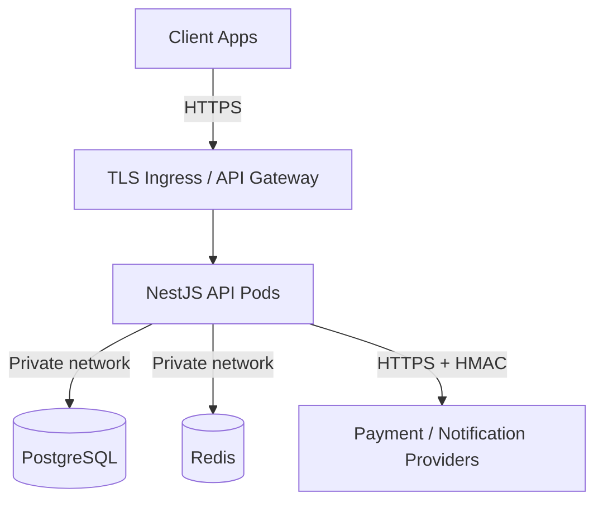
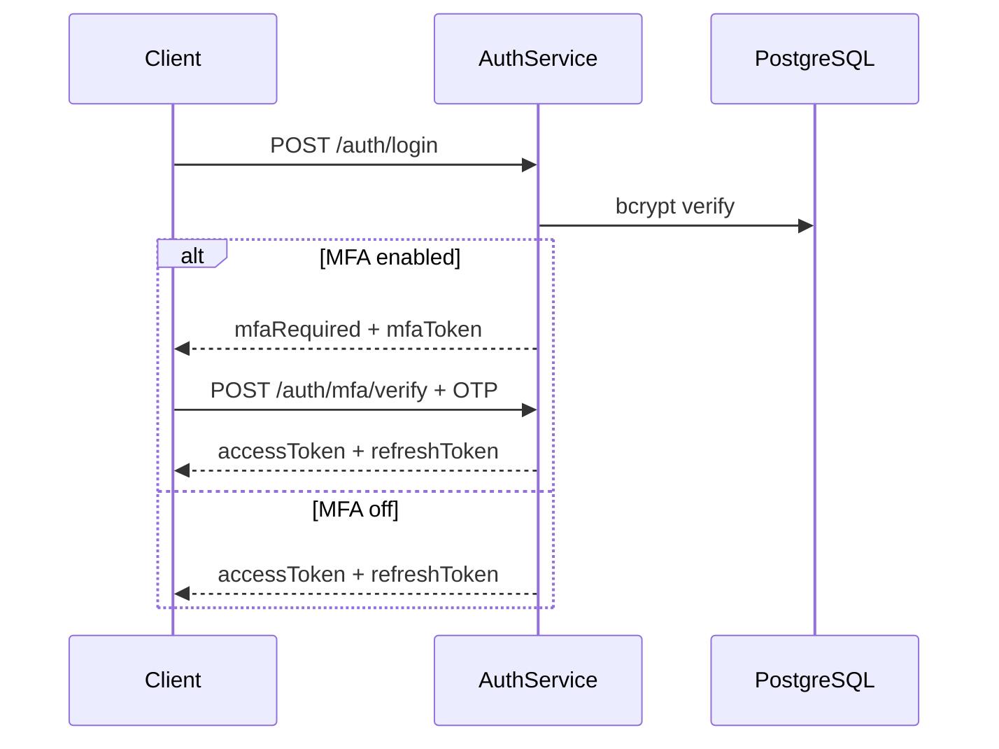

# Security Policy

Security architecture, controls, and operational practices for the Amrutam Telemedicine Backend.

**Related:** [ADR-007 JWT](./docs/adr/007-jwt-authentication.md) · [ADR-008 RBAC](./docs/adr/008-rbac.md) · [observability.md](./docs/observability.md) · [TESTING.md](./docs/TESTING.md)

---

## Overview

The Amrutam API processes **Protected Health Information (PHI)**, authentication credentials, and payment data. Security is implemented as **defense in depth** across network, application, data, and operational layers.

| Layer | Controls |
|-------|----------|
| Network | TLS at ingress, Kubernetes NetworkPolicy, private subnets for data tier |
| Application | Helmet, CORS allowlist, rate limiting, DTO validation |
| Authentication | JWT bearer tokens, bcrypt passwords, refresh rotation, **TOTP MFA** |
| Authorization | RBAC guards + service-level resource ownership |
| Data | PHI log masking, immutable audit trail, append-only clinical records |
| Operations | `npm audit` in CI, secret management, env validation at boot |

---

## Threat Model

Analysis uses the **STRIDE** framework.

### Assets

| Asset | Sensitivity | Storage |
|-------|-------------|---------|
| Clinical notes, prescriptions, diagnoses | PHI — highest | PostgreSQL |
| User credentials (password hashes) | Critical | PostgreSQL |
| JWT access / refresh tokens | High | Client + `refresh_tokens` table (hash only) |
| Payment references and amounts | Confidential | PostgreSQL |
| Audit logs | Integrity-critical | PostgreSQL (append-only) |
| Session metadata | Internal | PostgreSQL |

### Trust boundaries



### STRIDE analysis

| Threat | Category | Mitigation in this codebase |
|--------|----------|----------------------------|
| Stolen password | Spoofing | TOTP MFA challenge after password login |
| Forged JWT | Spoofing | HS256 with 32+ char secrets; `JwtStrategy` reloads user; expiry enforced |
| Brute-force login | Spoofing | Rate limiting; uniform error messages; `FAILED_LOGIN` audit |
| Patient reads another's records | Elevation of privilege | `RolesGuard` + service ownership checks on every resource |
| Double-booking race | Tampering | Optimistic locking on `AvailabilitySlot.version` |
| Prescription history altered | Tampering | Append-only `PrescriptionVersion`; no DELETE in application code |
| PHI in log aggregator | Information disclosure | `sanitizeForLog()` before Winston emission |
| API flood | Denial of service | `ThrottlerGuard` (configurable TTL/limit) |
| Repudiation of booking | Repudiation | Immutable `audit_logs` with IP, userAgent, correlationId |
| Weak production config | Elevation of privilege | `env.validation.ts` rejects default JWT secrets when `NODE_ENV=production` |
| Webhook replay / spoof | Spoofing | HMAC-SHA256 on `x-webhook-signature` |

### Residual risks

| Risk | Likelihood | Impact | Mitigation path |
|------|------------|--------|-----------------|
| Stolen refresh token (XSS on client) | Medium | High | Short access TTL (15m); refresh rotation; future httpOnly cookie option |
| Compromised admin account | Low | Critical | Audit logging; least privilege; **TOTP MFA** |
| Insider data exfiltration | Low | High | Audit trail; no bulk export API for patients |
| Zero-day in npm dependency | Medium | Variable | CI `npm audit`; pinned lockfile; Dependabot recommended |
| Redis cache poisoning | Low | Medium | Redis on private network; no user-controlled cache keys |

---

## OWASP Top 10 Mitigations

| # | Category | Status | Implementation |
|---|----------|--------|----------------|
| A01 | Broken Access Control | **Mitigated** | `JwtAuthGuard`, `RolesGuard`, ownership checks in services (`create-booking.service.ts`, `payment.service.ts`) |
| A02 | Cryptographic Failures | **Mitigated** | bcrypt (default 12 rounds); JWT secrets validated; refresh tokens stored as SHA-256 hash |
| A03 | Injection | **Mitigated** | Prisma parameterized queries; global `ValidationPipe` with `whitelist` + `forbidNonWhitelisted` |
| A04 | Insecure Design | **Mitigated** | Transactional outbox; idempotency keys; explicit state machines |
| A05 | Security Misconfiguration | **Mitigated** | Helmet; production env validation; Swagger disableable via `SWAGGER_ENABLED=false` |
| A06 | Vulnerable Components | **Mitigated** | `npm audit --audit-level=high` in CI (`security-audit` job) |
| A07 | Authentication Failures | **Mitigated** | Token expiry; `UserStatus.ACTIVE` check; account lock via status enum |
| A08 | Data Integrity Failures | **Mitigated** | Webhook HMAC; idempotency payload hash; optimistic locking |
| A09 | Logging & Monitoring Failures | **Mitigated** | Structured JSON logs; security events in `GlobalExceptionFilter`; Prometheus metrics |
| A10 | SSRF | **N/A** | No user-controlled outbound URL fetching |

---

## Data Classification

| Class | Examples | Handling |
|-------|----------|----------|
| **Public** | Doctor specializations, Swagger docs, health liveness | No restrictions |
| **Internal** | Queue metrics, appointment counts, infra configs | Internal network; not in client responses |
| **Confidential** | Email, phone, payment IDs, session IP | RBAC; TLS; masked in logs |
| **Sensitive Medical (PHI)** | Diagnosis, symptoms, prescriptions, clinical notes | Strict RBAC; never logged; audit on access/modification |

### Rules enforced in code

- Sensitive medical data **never** appears in Prometheus labels or unstructured logs
- API responses filtered by role — patients cannot access other patients' consultations
- `AuditService.log()` records actor, action, resource, IP, and `correlationId` on sensitive operations
- Clinical records use **append-only versioning** — updates create new versions

---

## Encryption

| Data state | Method | Notes |
|------------|--------|-------|
| **In transit** | TLS 1.2+ at ingress | HTTPS to external payment providers |
| **At rest (database)** | Managed PostgreSQL encryption | AWS RDS / Cloud SQL default or customer-managed keys |
| **At rest (Redis)** | Provider encryption at rest | ElastiCache / Memorystore when managed |
| **Passwords** | bcrypt | Configurable via `BCRYPT_ROUNDS` (default 12) |
| **TOTP secrets (at rest)** | AES-256-GCM | `MFA_ENCRYPTION_KEY`; see `mfa-crypto.util.ts` |
| **MFA recovery codes** | SHA-256 hashes | Shown once at enrollment |
| **Refresh tokens (stored)** | SHA-256 hash | Plain token only on client; `auth.service.ts` `hashToken()` |
| **JWT signing** | HS256 | Separate access and refresh secrets |
| **Webhooks** | HMAC-SHA256 | `PAYMENT_WEBHOOK_SECRET`; header `x-webhook-signature` |

**Not implemented:** Application-level field encryption for PHI columns. Reliance is on database-level encryption and access controls. Document as future enhancement for HIPAA-heavy deployments.

---

## JWT Strategy

### Token types

| Token | Lifetime | Secret | Storage |
|-------|----------|--------|---------|
| Access token | 15m (`JWT_ACCESS_EXPIRES_IN`) | `JWT_ACCESS_SECRET` | Client memory |
| Refresh token | 7d (`JWT_REFRESH_EXPIRES_IN`) | `JWT_REFRESH_SECRET` | Client; DB stores SHA-256 hash |
| MFA challenge | 5m | `JWT_ACCESS_SECRET` + `purpose: mfa` | Ephemeral after password login |

### MFA (TOTP)

When `MFA_ENABLED=true` and the user completed enrollment (`mfa.service.ts`):

1. `POST /auth/mfa/enable` — encrypted TOTP secret + QR + recovery codes
2. `POST /auth/mfa/verify-setup` — confirm OTP → `mfaEnabled=true`
3. `POST /auth/login` — may return `{ mfaRequired, mfaToken }`
4. `POST /auth/mfa/verify` — OTP or recovery code → access/refresh tokens
5. `POST /auth/mfa/disable` — password + OTP/recovery

### Flow



### Security properties

- **Global guard:** `JwtAuthGuard`; `@Public()` for login, register, MFA challenge, health, webhooks
- **Live revocation:** `JwtStrategy.validate()` queries DB — deactivated users rejected immediately
- **No sensitive claims in JWT:** Payload contains `sub`, `email`, `roles` (MFA challenge adds `purpose`)
- **Rotation:** Each refresh revokes the previous refresh token before issuing new pair

### Trade-off

DB lookup on every authenticated request ensures immediate deactivation but adds latency. Mitigated with minimal `select` in `jwt.strategy.ts`. Redis auth cache (30s TTL) documented in scaling plan.

---

## RBAC

### Roles

| Role | Capabilities |
|------|--------------|
| **Patient** | Book appointments, view own consultations/prescriptions, initiate payments |
| **Doctor** | Manage slots/leaves, start/complete consultations, write prescriptions |
| **Admin** | Dashboard, analytics, audit query, global search |
| **Super Admin** | Same as Admin (extensible) |

### Enforcement layers

1. **`@Roles()` decorator** — HTTP-level role requirement via `RolesGuard`
2. **Service ownership** — e.g., patient can only cancel own appointments; doctor only assigned consultations
3. **`@Public()`** — Explicit bypass of JWT for documented public endpoints

```typescript
// Example: appointments.controller.ts
@UseGuards(JwtAuthGuard, RolesGuard)
@Roles(RoleName.PATIENT)
@Post()
create(...) { ... }
```

Unit tests: `test/unit/roles.guard.spec.ts`

### Why enum roles vs permission matrix

Simpler to audit and sufficient for four roles. A database-backed permission matrix is deferred until custom per-resource permissions are required.

---

## Rate Limiting

Global `ThrottlerGuard` registered in `app.module.ts`:

| Setting | Env variable | Default |
|---------|--------------|---------|
| Window | `THROTTLE_TTL` | 60000 ms |
| Max requests | `THROTTLE_LIMIT` | 100 per window per IP |

Exceeded limit returns **429** with standard error envelope.

**CI override:** `THROTTLE_LIMIT=1000` in GitHub Actions to avoid integration test flakiness.

**Production recommendation:** Stricter limits on `/auth/login` and `/auth/register` via route-specific throttler (future enhancement).

---

## Secrets Management

### Application secrets

| Secret | Purpose | Rotation |
|--------|---------|----------|
| `JWT_ACCESS_SECRET` | Access token signing | Quarterly or on compromise |
| `JWT_REFRESH_SECRET` | Refresh token signing | Quarterly or on compromise |
| `DATABASE_URL` | PostgreSQL credentials | On credential rotation |
| `PAYMENT_WEBHOOK_SECRET` | Webhook HMAC verification | On provider rotation |
| `REDIS_PASSWORD` | Redis authentication | On credential rotation |

### Storage by environment

| Environment | Method |
|-------------|--------|
| **Development** | `.env` from `.env.example` — never commit `.env` |
| **CI** | GitHub Actions `env:` block (test-only values) |
| **Production** | Kubernetes Secrets, AWS Secrets Manager, or External Secrets Operator |

### Boot-time validation

`src/config/env.validation.ts` (class-validator):

- Rejects JWT secrets shorter than 32 characters in production
- Rejects known default secret strings when `NODE_ENV=production`
- Fails fast — pod will not start with weak configuration

### Rules

- Never commit populated `infra/k8s/secret.yaml`
- Never log secrets or full JWT tokens
- Rotate all secrets after suspected compromise

---

## Audit Logs

### What is audited

| Category | Actions |
|----------|---------|
| Authentication | `REGISTER`, `LOGIN`, `LOGOUT`, `FAILED_LOGIN`, `PROFILE_UPDATE` |
| Booking | `APPOINTMENT_BOOKED`, `APPOINTMENT_CANCELLED`, `APPOINTMENT_RESCHEDULED` |
| Clinical | `CONSULTATION_STARTED`, `CONSULTATION_COMPLETED`, `NOTES_UPDATED` |
| Prescriptions | `PRESCRIPTION_CREATED`, `PRESCRIPTION_UPDATED`, `PRESCRIPTION_CANCELLED` |
| Payments | `PAYMENT_INITIATED`, `PAYMENT_CAPTURED`, `PAYMENT_REFUNDED`, `WEBHOOK_RECEIVED` |

### Record schema

Each `audit_logs` row includes:

- `userId`, `action`, `resourceType`, `resourceId`
- `metadata` (sanitized JSON)
- `ipAddress`, `userAgent`
- `correlationId`, `requestId`
- `timestamp` (immutable — no UPDATE/DELETE in application code)

### Query

Admins: `GET /api/v1/admin/audit` with filters on user, action, date range, cursor pagination.

---

## Dependency Scanning

### CI pipeline

Job `security-audit` in [`.github/workflows/ci.yml`](.github/workflows/ci.yml):

```bash
npm audit --audit-level=high
```

Fails CI on high or critical vulnerabilities.

### Local

```bash
npm run audit:deps
```

### Recommended additions (not yet configured)

- **Dependabot** — automated PRs for dependency updates
- **Snyk / Socket** — deeper transitive dependency analysis
- **Container scanning** — Trivy on Docker image in CI (future)

---

## Security Checklist

### Pre-deployment

- [ ] `NODE_ENV=production`
- [ ] JWT secrets are 32+ random characters (not `.env.example` defaults)
- [ ] `SWAGGER_ENABLED=false` in production (or IP-restricted)
- [ ] `CORS_ORIGINS` lists only trusted front-end origins
- [ ] TLS configured on ingress with valid certificate
- [ ] PostgreSQL and Redis not publicly accessible
- [ ] Kubernetes NetworkPolicy applied (`infra/k8s/networkpolicy.yaml`)
- [ ] Secrets stored in vault/K8s Secrets — not in image or git
- [ ] `PAYMENT_WEBHOOK_SECRET` matches provider dashboard
- [ ] Rate limits appropriate for expected traffic
- [ ] Prometheus alerts configured for error rate and auth failures
- [ ] Backup and restore tested ([RUNBOOK.md](./docs/RUNBOOK.md))

### Pre-release code review

- [ ] New endpoints have `@Roles()` or `@Public()` explicitly set
- [ ] Service-level ownership check for resource access
- [ ] DTOs use `class-validator` decorators
- [ ] No PHI in log statements (use `sanitizeForLog()`)
- [ ] Side effects use outbox — no external HTTP inside `$transaction`
- [ ] Audit log called for sensitive mutations

### Incident response

| Severity | Example | Response time |
|----------|---------|---------------|
| SEV-1 | Suspected data breach, API fully down | Immediate |
| SEV-2 | Auth bypass suspected, partial outage | 30 minutes |
| SEV-3 | Failed dependency audit, non-critical bug | Next business day |

Steps: Detect → Contain (rotate secrets) → Investigate (audit + Jaeger) → Remediate → Post-mortem.

---

## Future Improvements

| Improvement | Priority | Notes |
|-------------|----------|-------|
| Per-route rate limits on auth | High | Brute-force protection on `/auth/login` and `/auth/mfa/verify` |
| Redis auth cache for JWT | Medium | Reduce DB load; 30s TTL with invalidation on status change |
| Field-level PHI encryption | Medium | For regulatory environments requiring column encryption |
| OAuth2 / social login | Low | Out of current assignment scope |
| WAF at ingress | Medium | AWS WAF / Cloudflare for production |
| Container image scanning | Medium | Trivy in CI docker-build job |
| Security headers audit | Low | Periodic review of Helmet configuration |
| Penetration test | High | Before public GA |
| Refresh token family detection | Medium | Detect token reuse attacks (revoke all sessions) |

---

## Reporting Vulnerabilities

If you discover a security vulnerability:

1. **Do not** open a public GitHub issue
2. Email **security@amrutam.example** with description, reproduction steps, and impact
3. Allow **90 days** for remediation before public disclosure

---

## Related Documents

- [docs/security/threat-model.md](./docs/security/threat-model.md) — Extended STRIDE analysis
- [docs/security/owasp-mitigations.md](./docs/security/owasp-mitigations.md) — Detailed OWASP matrix
- [docs/security/data-classification.md](./docs/security/data-classification.md) — Full classification matrix
- [docs/security/security-checklist.md](./docs/security/security-checklist.md) — Expanded deployment checklist
- [docs/RUNBOOK.md](./docs/RUNBOOK.md) — Incident response procedures
- [docs/TESTING.md](./docs/TESTING.md) — Security-related unit tests

---

*Last updated: 2026-07-10*
