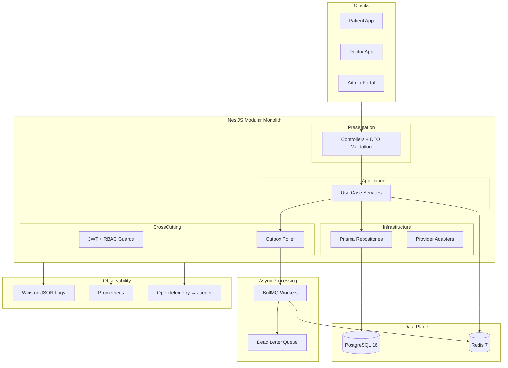
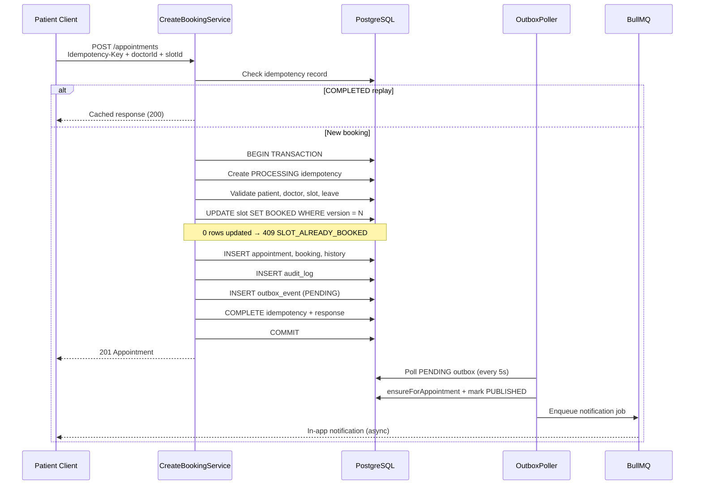
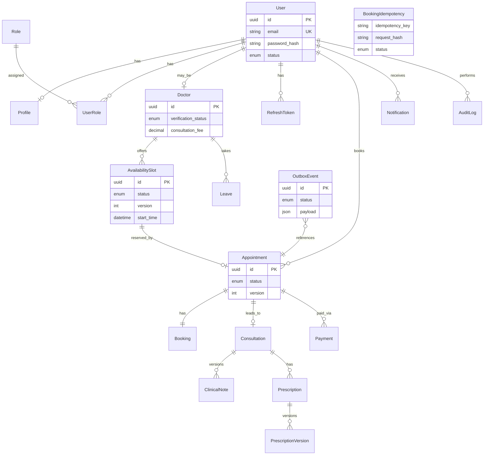
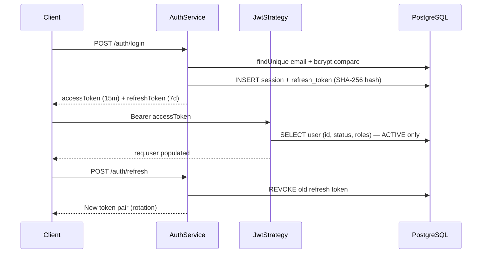
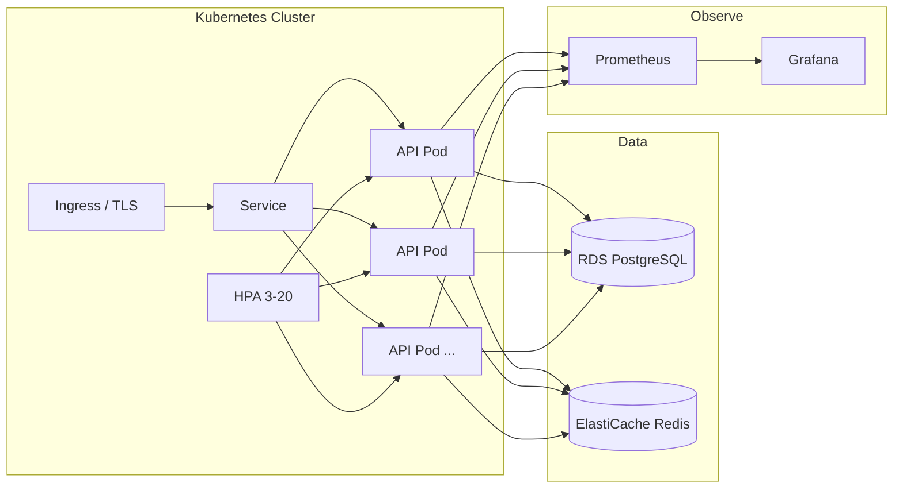

# Architecture

**Amrutam Telemedicine Backend** — system design for a production-grade Ayurveda telemedicine API.  
**Audience:** Hiring reviewers, staff engineers, and operators.  
**Companion:** [diagrams.md](./diagrams.md) · [openapi.yaml](./openapi.yaml) · [adr/](./adr/)

---

## Business Overview

Amrutam connects patients with verified Ayurveda practitioners for online consultations. The platform lifecycle spans:

1. **Discovery** — patients search verified doctors and browse available slots  
2. **Booking** — patients reserve slots with correctness guarantees under concurrency  
3. **Clinical** — doctors conduct consultations, record versioned notes, issue prescriptions  
4. **Payment** — patients pay consultation fees via a provider adapter  
5. **Operations** — admins monitor KPIs, audit sensitive actions, investigate incidents  

The backend is a **modular monolith**: one deployable unit with domain module boundaries that map to future microservice extraction points. The primary design constraint is **correctness under concurrency** — two patients must never book the same slot, and HTTP retries must not create duplicate appointments.

---

## High-Level Architecture



Each module under `src/modules/` follows **Clean Architecture**:

```
module/
├── presentation/     # HTTP controllers — no business logic
├── application/      # Use cases (services) + DTOs
├── infrastructure/   # Prisma repositories, adapters
└── domain/           # Enums, state machines, invariants
```

Reference implementation: `src/modules/bookings/`.

---

## Booking Sequence Diagram

The booking path is the highest-contention use case. Three mechanisms protect it: **idempotency**, **optimistic locking**, and **transactional outbox**.



Implementation: `create-booking.service.ts` · `slot.repository.ts` · `outbox-poller.service.ts`

---

## ER Diagram (Core Domain)



Full schema: 39 models in `prisma/schema.prisma`.

---

## Authentication Flow



- **Global guard:** `JwtAuthGuard` on all routes; `@Public()` for login, register, doctor search, health, webhooks  
- **RBAC:** `RolesGuard` + `@Roles('Patient'|'Doctor'|'Admin')` on protected controllers  
- **Ownership:** Services verify resource belongs to caller (appointments, payments, consultations)  

See [ADR-007](./adr/007-jwt-authentication.md) · [ADR-008](./adr/008-rbac.md).

---

## Caching Strategy

**Pattern:** Cache-aside with stampede protection (`CacheService`).

| Workload | Key pattern | TTL | Invalidation |
|----------|-------------|-----|--------------|
| Doctor search | `doctors:search:{keyword}:{spec}:{limit}` | 60s | TTL + pattern invalidation on profile change |
| Admin dashboard | `admin:dashboard:{date}` | 60s | TTL |
| Analytics | `analytics:{period}:{range}` | 60s | TTL |

**Stampede protection:** On cache miss, acquire Redis lock `lock:{key}` with `SET NX EX`. Only one request repopulates; others wait 50ms and retry get.

**Not cached:** Slot availability (high write churn), booking mutations, auth validation.

**Observability:** `cache_hits_total` / `cache_misses_total` Prometheus counters.

PostgreSQL remains source of truth — cache is never authoritative.

---

## Concurrency Strategy

| Mechanism | Entity | Implementation |
|-----------|--------|----------------|
| **Optimistic locking** | `AvailabilitySlot` | `updateMany` WHERE `version = expected` AND `status = AVAILABLE` |
| **Idempotency keys** | Booking HTTP requests | `booking_idempotency` table, 24h TTL, payload hash |
| **DB transactions** | Booking, cancel, reschedule | `prisma.$transaction` wraps all writes |
| **State machines** | Appointment, Consultation | `canTransition()` enforced in services |

**Why optimistic over pessimistic:** `SELECT FOR UPDATE` holds connections during validation and increases deadlock risk under morning booking rushes. `slot.repository.ts` provides `findByIdForUpdate` but the hot path uses version-based `updateMany`.

**Client contract:** `409 SLOT_ALREADY_BOOKED` means retry with a different slot; not a server error.

---

## Outbox Pattern

**Problem:** Publishing to external systems (notifications, analytics) inside a DB transaction creates dual-write inconsistency.

**Solution:** Write `outbox_events` row in the same transaction as the business mutation. A poller dispatches asynchronously.

```
Booking TX ──► outbox_events (PENDING)
                    │
                    ▼ (every 5s)
              OutboxPollerService
                    │
        ┌───────────┼───────────┐
        ▼           ▼           ▼
  Consultation  Notification  PDF job
  ensure        BullMQ queue   (prescription)
```

- **Write side:** `OutboxService.store(input, tx)` — never HTTP inside transaction  
- **Read side:** `OutboxPollerService` — batch 50 PENDING, mark PUBLISHED or FAILED  
- **Failure:** After 5 BullMQ retries → `DeadLetterService`  

See [ADR-006](./adr/006-transactional-outbox.md).

---

## Database Design

| Principle | Application |
|-----------|-------------|
| Single PostgreSQL instance | ACID across booking + audit + outbox |
| UUID primary keys | Distributed-safe identifiers |
| Optimistic `version` columns | `AvailabilitySlot`, `Appointment` |
| Append-only clinical data | `ClinicalNote`, `PrescriptionVersion` |
| Immutable audit | `audit_logs` — no update endpoint |
| Partial indexes | `outbox_events WHERE status = PENDING` |
| Text search | `pg_trgm` GIN indexes on doctor names/bio |

**ORM:** Prisma with repository wrappers — services never import Prisma in controllers. Migrations in `prisma/migrations/`.

---

## Scalability

| Tier | Strategy |
|------|----------|
| **API** | Stateless pods, HPA 3–20 replicas, JWT (no server sessions) |
| **Database** | Connection pooling (`connection_limit=20`), read replica at 50K+ consultations/day |
| **Cache** | Redis cluster; separate instances for cache vs queue at scale |
| **Async** | Extract notification worker first; outbox events become inter-service contract |
| **Search** | Materialized views / Elasticsearch at >1M doctor records |

Full plan: [SCALING_PLAN.md](./SCALING_PLAN.md) — target 100K consultations/day, path to 1M users.

---

## Reliability

| Concern | Mitigation |
|---------|------------|
| Partial booking failure | Single DB transaction — all-or-nothing |
| Duplicate bookings on retry | Idempotency keys with payload hash |
| Lost notifications | Transactional outbox + BullMQ retry (5 attempts) |
| Poison messages | Dead-letter queue with admin visibility |
| Provider outage | Mock adapter in dev; circuit breaker on payment adapter |
| Process crash | K8s liveness/readiness probes, graceful SIGTERM drain |
| Data loss | PostgreSQL persistent volumes, backup/DR documented in RUNBOOK |

---

## Observability

| Pillar | Tool | Endpoint |
|--------|------|----------|
| Logs | Winston JSON + `sanitizeForLog()` | stdout → aggregator |
| Metrics | Prometheus (`prom-client`) | `GET /api/v1/metrics` |
| Traces | OpenTelemetry OTLP | Jaeger UI :16686 |
| Health | NestJS Terminus | `/health/live`, `/health/ready`, `/health` |

**Correlation:** `X-Correlation-Id` propagated via `AsyncLocalStorage` through HTTP → audit → outbox → BullMQ jobs.

Guide: [observability.md](./observability.md)

---

## Security

| Layer | Control |
|-------|---------|
| Network | Helmet headers, CORS allowlist, rate limiting |
| AuthN | JWT access (15m) + refresh rotation (7d) |
| AuthZ | RBAC guards + service-level ownership |
| Data | bcrypt passwords, SHA-256 refresh token hashes |
| Audit | Immutable log on login, booking, clinical, payment events |
| Privacy | PHI masking in structured logs |
| Webhooks | HMAC-SHA256 signature verification |
| Config | Joi validation rejects weak secrets in production |

Policy: [SECURITY.md](../SECURITY.md)

---

## Deployment Architecture



- **Container:** Multi-stage Dockerfile, non-root user, healthcheck  
- **Probes:** Liveness = memory; Readiness = DB + Redis + queue  
- **Rollout:** `maxUnavailable: 0`, `preStop` hook, 60s grace period  
- **IaC:** Terraform skeleton in `infra/terraform/`  

Runbook: [RUNBOOK.md](./RUNBOOK.md)

---

## Trade-offs

| Decision | Chosen | Rejected | Why |
|----------|--------|----------|-----|
| Service topology | Modular monolith | Microservices day one | ACID booking boundary |
| Slot locking | Optimistic (`version`) | Pessimistic (`FOR UPDATE`) | Throughput, fewer deadlocks |
| Side effects | Transactional outbox | Direct HTTP in TX | Dual-write safety |
| Outbox dispatch | 5s polling | PostgreSQL NOTIFY | PgBouncer compatibility |
| Auth validation | DB reload per request | Pure JWT trust | Immediate deactivation |
| RBAC | Enum roles | Permission matrix DB | Simplicity at current scale |
| Cache | Cache-aside + TTL | Write-through | PostgreSQL is source of truth |

---

## Future Evolution

1. **Extract notification worker** — outbox events already define the contract  
2. **Read replicas** — doctor search and admin dashboard off primary  
3. **Redis auth cache** — 30s TTL on JWT validation at scale  
4. **MFA TOTP** — schema ready (`mfa_enabled`, `mfa_secret`)  
5. **Availability rules engine** — auto-generate slots from recurring rules  
6. **Event streaming** — outbox rows → Kafka for analytics pipeline  
7. **Materialized views** — dashboard aggregates at >1M appointment rows  

Module boundaries in `src/modules/` are deliberate extraction points. The outbox event payload schema is the inter-service API contract for future decomposition.

---

*Last updated: 2026-07-10 · v1.0.0*
