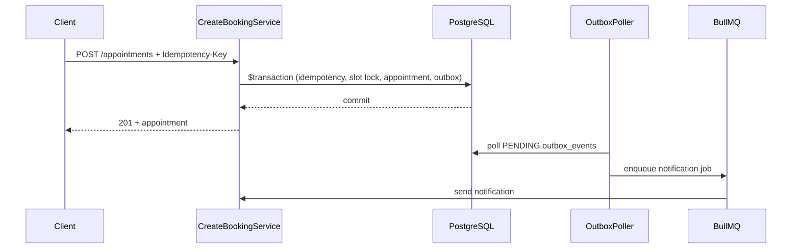

# Interview Preparation — 100 Backend Questions

Every answer references **this repository only**. Use this to defend architecture decisions in a live interview.

**Companion docs:** [REVIEWER_GUIDE.md](./REVIEWER_GUIDE.md) · [ARCHITECTURE.md](./ARCHITECTURE.md) · [ADRs](./adr/)

---

## Table of Contents

1. [Architecture & Design (Q1–15)](#architecture--design-q115)
2. [Booking & Concurrency (Q16–30)](#booking--concurrency-q1630)
3. [Idempotency (Q31–38)](#idempotency-q3138)
4. [Transactional Outbox (Q39–48)](#transactional-outbox-q3948)
5. [Database & Prisma (Q49–58)](#database--prisma-q4958)
6. [Redis & Caching (Q59–66)](#redis--caching-q5966)
7. [BullMQ & Async Processing (Q67–72)](#bullmq--async-processing-q6772)
8. [Authentication & Security (Q73–82)](#authentication--security-q7382)
9. [Observability (Q83–88)](#observability-q8388)
10. [Testing & CI/CD (Q89–93)](#testing--cicd-q8993)
11. [Deployment & Scaling (Q94–100)](#deployment--scaling-q94100)

---

## Architecture & Design (Q1–15)

### Q1. Why did you choose a modular monolith over microservices?

**Answer:** The highest-contention path — booking — requires atomic writes across `availability_slots`, `appointments`, `booking_idempotency`, `audit_logs`, and `outbox_events`. Splitting into microservices would force distributed transactions or Sagas for the one operation that matters most. We chose a single deployable with module boundaries (`bookings/`, `consultations/`, `payments/`) that map to future extraction points. See [ADR-001](./adr/001-modular-monolith.md) and `src/app.module.ts`.

**Rejected:** Pure microservices — operational overhead without solving the booking consistency problem. **Tradeoff:** All modules scale together until we extract workers (notifications) first.

---

### Q2. What does "Clean Architecture" mean in this codebase?

**Answer:** Each module has four layers: `presentation/` (controllers), `application/services/` (use cases), `infrastructure/persistence/` (Prisma repositories), `domain/enums/` (state machines). Controllers never call Prisma. Example: `appointments.controller.ts` delegates to `CreateBookingService`, which uses `SlotRepository`. Business rules live in services and domain enums, not in HTTP handlers.

**Rejected:** Anemic controllers with Prisma in every route — untestable and couples HTTP to persistence.

---

### Q3. How do modules communicate without tight coupling?

**Answer:** Synchronous calls stay within bounded contexts (e.g., booking reads doctor via Prisma inside its transaction). Cross-cutting side effects use the transactional outbox (`OutboxService.store()` in `src/events/outbox.service.ts`). The poller dispatches events without the booking service knowing about notification infrastructure. This is the extraction contract for future services.

**Rejected:** Direct `NotificationService.send()` inside `$transaction` — dual-write risk if notification fails after commit.

---

### Q4. Why NestJS specifically?

**Answer:** NestJS provides dependency injection, module boundaries, global guards/interceptors, and first-class Swagger integration — all used in `app.module.ts` (global `JwtAuthGuard`, `LoggingInterceptor`, `MetricsInterceptor`). The decorator model maps cleanly to RBAC (`@Roles()`, `@Public()`).

**Rejected:** Express without structure — would reinvent module wiring and guard pipelines.

---

### Q5. What is the primary design constraint of this system?

**Answer:** **Correctness under concurrency.** Two patients must never book the same slot; a network retry must not create duplicate appointments. Every major pattern — idempotency, optimistic locking, transactional outbox — serves this constraint. Stated explicitly in README and `create-booking.service.ts` comments.

---

### Q6. How many domain models exist and where are they defined?

**Answer:** 39 Prisma models in `prisma/schema.prisma`, grouped by domain comments (Auth, Doctors, Booking, Clinical, Payments, Notifications, Admin). Single schema enables foreign keys and ACID transactions across domains.

**Tradeoff:** Large schema file vs. split databases — we chose one PostgreSQL instance for transactional integrity.

---

### Q7. What is CQRS-lite in this project?

**Answer:** We do not have separate read databases. But writes go through transactional services while reads use optimized paths: `doctor-search.service.ts` caches search results; `dashboard.service.ts` and `analytics.service.ts` cache aggregates; list repositories use explicit `select` instead of broad `include`. This is read optimization without event-sourced read models.

**Rejected:** Full CQRS with separate read DB — overkill for current scale; documented in SCALING_PLAN for 1M+ users.

---

### Q8. Where are architectural decisions documented?

**Answer:** Eight ADRs in `docs/adr/` (modular monolith, Prisma, PostgreSQL, Redis, BullMQ, outbox, JWT, RBAC). Each records context, decision, consequences, and rejected alternatives.

---

### Q9. What global cross-cutting concerns are wired in `app.module.ts`?

**Answer:** `APP_GUARD` → `JwtAuthGuard` (auth by default), `APP_FILTER` → `GlobalExceptionFilter`, `APP_INTERCEPTOR` → `LoggingInterceptor`, `TransformInterceptor`, `MetricsInterceptor`. Health, metrics, tracing modules are imported globally.

---

### Q10. How does the API versioning work?

**Answer:** Global prefix `api/v1` set in `main.ts`. All routes are versioned. Future v2 can coexist via NestJS versioning without breaking v1 clients.

---

### Q11. What is the standard API response envelope?

**Answer:** `TransformInterceptor` wraps successful responses in `{ success: true, data, meta }`. Errors use `GlobalExceptionFilter` with `{ success: false, error: { code, message, statusCode } }` and stable `ErrorCode` enum from `@common/constants`.

**Why:** Consistent client parsing; `ErrorCode` enables programmatic handling (e.g., `SLOT_ALREADY_BOOKED`).

---

### Q12. Why DTO validation at the controller boundary?

**Answer:** `class-validator` DTOs (e.g., `CreateAppointmentDto`) with global `ValidationPipe` in `main.ts` (`whitelist: true`, `forbidNonWhitelisted: true`). Invalid input never reaches services — reduces attack surface and keeps services focused on business rules.

---

### Q13. What is `DomainException` and why use it?

**Answer:** `src/common/exceptions/domain.exception.ts` carries `ErrorCode`, HTTP status, and message. Services throw domain exceptions; the global filter maps them to the API envelope. Booking throws `SLOT_ALREADY_BOOKED` (409) instead of generic 500 — clients can retry intelligently.

---

### Q14. How is correlation ID propagated?

**Answer:** `CorrelationMiddleware` reads/generates `X-Correlation-Id`, stores in `AsyncLocalStorage` via `correlation.context.ts`. Logging interceptor, audit logs, outbox job enqueue, and BullMQ workers use `runWithCorrelationAsync()` to preserve traceability across async boundaries.

---

### Q15. What would you extract first if splitting to microservices?

**Answer:** Notification worker (`OutboxPollerService` + BullMQ `NOTIFICATIONS` queue) — already async, stateless, and fed by outbox events. Booking stays monolithic until read replicas and materialized views are needed. Documented in `docs/SCALING_PLAN.md`.

---

## Booking & Concurrency (Q16–30)

### Q16. Walk through the booking flow step by step.

**Answer:** `CreateBookingService.execute()` in `create-booking.service.ts`:
1. Validate `Idempotency-Key` header
2. Check idempotency record (replay / conflict / processing)
3. Open `$transaction`
4. Create PROCESSING idempotency record
5. Validate patient (ACTIVE, Patient role)
6. Validate doctor (exists, VERIFIED, not self-booking)
7. Validate slot (exists, AVAILABLE, future, matches doctor, not on leave)
8. `reserveSlot()` with optimistic lock
9. Create appointment + booking record + history
10. Audit log + outbox event
11. Complete idempotency with response body

All steps 4–11 are atomic.

---

### Q17. How does optimistic locking prevent double booking?

**Answer:** `SlotRepository.reserveSlot()` uses `updateMany` with `where: { id, status: AVAILABLE, version: expectedVersion }`. If `count === 0`, another transaction won — throw `SLOT_ALREADY_BOOKED` (409). Version increments on success. See `slot.repository.ts` lines 45–64.

**Rejected:** Pessimistic `SELECT FOR UPDATE` as primary strategy — holds connections longer; we have `findByIdForUpdate` available but use optimistic for the hot path.

---

### Q18. Why `updateMany` instead of `update` for slot reservation?

**Answer:** Prisma `update` throws if row not found; `updateMany` returns `count` letting us distinguish "slot doesn't exist" (caught earlier) from "version mismatch / already booked" without exception-driven flow control.

---

### Q19. What happens when two users book the same slot simultaneously?

**Answer:** Both read slot with `version: 5`. First transaction's `updateMany` succeeds → `version: 6`, status `BOOKED`. Second's `updateMany` matches zero rows → `DomainException` with `SLOT_ALREADY_BOOKED`. Second client gets 409, not a duplicate appointment.

---

### Q20. Why is slot release also versioned?

**Answer:** `releaseSlot()` in `slot.repository.ts` increments version when cancelling/rescheduling. Prevents lost updates if a stale cancel races with a reschedule.

---

### Q21. What validations happen before slot reservation?

**Answer:** Patient active + Patient role; doctor verified; no self-booking; slot exists, AVAILABLE, in future, belongs to doctor; doctor not on leave (`leave.findFirst` date range check). All inside the transaction so state cannot change between check and reserve... except version which optimistic lock handles.

---

### Q22. Why create a separate `Booking` record in addition to `Appointment`?

**Answer:** `Booking` stores `idempotencyKey` linking the HTTP idempotency contract to the domain aggregate. `appointments` is the clinical/scheduling entity; `bookings` is the booking attempt audit trail. Schema in `prisma/schema.prisma`.

---

### Q23. How does cancel work?

**Answer:** `CancelAppointmentService` validates status transition via `canTransition()` from `appointment-status.enum.ts`, releases slot via `releaseSlot()`, writes history, audit, and outbox event — all in a transaction. Same patterns as create.

---

### Q24. How does reschedule work?

**Answer:** `RescheduleAppointmentService` reserves a new slot (optimistic lock), updates appointment times, releases old slot, records history with `toSlotId`, emits outbox. Two slot mutations in one transaction — if new slot fails, old slot stays booked.

---

### Q25. What appointment statuses exist and what transitions are allowed?

**Answer:** `AppointmentStatusEnum`: PENDING → CONFIRMED/CANCELLED; CONFIRMED → COMPLETED/CANCELLED/NO_SHOW/RESCHEDULED; terminal states have no outbound transitions. `canTransition()` enforces at service layer. New bookings go directly to CONFIRMED.

---

### Q26. Why can't doctors book their own slots?

**Answer:** Explicit check `doctor.userId === user.id` → `DOCTOR_SELF_BOOKING` (403). Prevents fee manipulation and audit anomalies. In `create-booking.service.ts` step 4.

---

### Q27. Why must doctors be VERIFIED to receive bookings?

**Answer:** `doctor.verificationStatus !== VerificationStatus.VERIFIED` → 403. Platform quality gate — unverified doctors are searchable only after verification in `doctor-search.service.ts` (also filters VERIFIED).

---

### Q28. What is `BookingHistoryAction` used for?

**Answer:** Append-only `appointment_history` records every state change (CREATED, CANCELLED, RESCHEDULED) with `performedBy`, `toStatus`, `toSlotId`. Supports admin audit and dispute resolution without soft-deleting appointments.

---

### Q29. Why is idempotency checked both before and inside the transaction?

**Answer:** Before: fast replay for completed requests (no transaction cost). Inside: `createProcessing` prevents two concurrent requests with the same key from both proceeding — second gets unique constraint or PROCESSING conflict.

---

### Q30. What error should a client send on 409 SLOT_ALREADY_BOOKED?

**Answer:** Client should fetch fresh slots (`GET /doctors/:id/slots`) and retry with a new slot + new idempotency key. Same idempotency key with same payload replays; with different slot ID it would be a payload hash mismatch (409 `IDEMPOTENCY_CONFLICT`).

---

## Idempotency (Q31–38)

### Q31. Why require `Idempotency-Key` on POST /appointments?

**Answer:** Mobile clients retry on timeout. Without idempotency, a succeeded booking + failed HTTP response → duplicate appointment on retry. Header is required in `CreateBookingService` and documented in Swagger (`main.ts` OpenAPI config).

---

### Q32. How is the idempotency key scoped?

**Answer:** `IdempotencyRepository.findByKey()` filters by `idempotencyKey` AND `patientId`. Patient A's key does not collide with Patient B's. Stored in `booking_idempotency` table.

---

### Q33. What is `requestHash` and why?

**Answer:** `createRequestHash(requestPayload)` in `idempotency.repository.ts` — SHA-256 of canonicalized payload. If same key is reused with different `doctorId`/`slotId`, return `IDEMPOTENCY_CONFLICT` (409). Prevents key reuse abuse.

---

### Q34. What are the idempotency statuses?

**Answer:** `PROCESSING`, `COMPLETED`, `FAILED`. COMPLETED with `responseBody` → replay cached response. PROCESSING → 409 "already being processed". FAILED → client may retry with same key.

---

### Q35. What is the idempotency TTL?

**Answer:** 24 hours (`IDEMPOTENCY_TTL_HOURS = 24` in `idempotency.repository.ts`). `expiresAt` filter on lookup. After expiry, same key can start a new booking.

---

### Q36. Is idempotency stored inside the booking transaction?

**Answer:** Yes. `createProcessing` and `complete` both receive `tx: TransactionClient`. If booking fails, idempotency row rolls back — client can retry cleanly.

---

### Q37. How is idempotency tested?

**Answer:** `test/unit/idempotency.spec.ts` and `test/unit/create-booking.service.spec.ts` mock `IdempotencyRepository` and verify replay/conflict paths.

---

### Q38. Why not use Redis for idempotency?

**Answer:** Idempotency must be consistent with the booking transaction. DB-backed idempotency in the same PostgreSQL transaction is correct; Redis would be a separate consistency boundary. **Tradeoff:** DB write overhead vs. correctness.

---

## Transactional Outbox (Q39–48)

### Q39. What problem does the outbox solve?

**Answer:** Dual-write problem: if we HTTP-call a notification provider inside a DB transaction, commit can succeed but notification fails (or vice versa). Outbox writes `outbox_events` in the same transaction as the booking; a separate poller publishes asynchronously. [ADR-006](./adr/006-transactional-outbox.md).

---

### Q40. What does `OutboxService.store()` do?

**Answer:** Inserts into `outbox_events` with `status: PENDING`, `aggregateType`, `aggregateId`, `eventType`, `payload` — all within the caller's transaction. Never publishes externally. See `src/events/outbox.service.ts`.

---

### Q41. How does the poller work?

**Answer:** `OutboxPollerService` schedules `POLL_OUTBOX` job every 5 seconds via `setInterval`. Worker fetches 50 PENDING events (ordered by `createdAt`), dispatches by `eventType`, marks PUBLISHED or FAILED with `retryCount`. See `outbox-poller.service.ts`.

---

### Q42. What happens on APPOINTMENT_BOOKED outbox event?

**Answer:** `dispatchEvent` calls `consultationRepo.ensureForAppointment()` to pre-create consultation record, then enqueues IN_APP notification via `NotificationService.createAndQueue()` → BullMQ `NOTIFICATIONS` queue.

---

### Q43. What other event types are handled?

**Answer:** `CONSULTATION_COMPLETED`, `PRESCRIPTION_CREATED` (also queues PDF job), `PAYMENT_CAPTURED` — each triggers patient notification. Constants in `OUTBOX_EVENTS` (`@common/constants`).

---

### Q44. What is in the appointment booked payload?

**Answer:** `buildAppointmentBookedPayload()` includes `notification`, `analytics`, `billing`, and `videoConsultation` sections — structured for future consumer extraction without changing the outbox contract.

---

### Q45. How are failed outbox events handled?

**Answer:** Status → `FAILED`, `retryCount` incremented, `lastError` stored. Poller can be extended to retry FAILED; currently manual ops via `docs/RUNBOOK.md`. Partial index on PENDING in performance migration optimizes poller query.

---

### Q46. Why poll every 5 seconds instead of LISTEN/NOTIFY?

**Answer:** Simplicity and portability — polling works across connection poolers (PgBouncer transaction mode). **Tradeoff:** Up to 5s notification delay vs. instant NOTIFY. Acceptable for appointment confirmations.

**Rejected:** Kafka as primary bus — operational complexity exceeds assignment scope; outbox rows are the future Kafka source.

---

### Q47. How does correlation ID reach notification workers?

**Answer:** `enqueueNotification` passes `correlationId` from `getCorrelationContext()` into BullMQ job data. `processNotificationJob` wraps execution in `runWithCorrelationAsync()`.

---

### Q48. What is the dead letter queue strategy?

**Answer:** `handleFailure()` in outbox poller — after 5 attempts (`job.opts.attempts`), `DeadLetterService.moveToDeadLetter()` persists failed job for manual replay. Prevents infinite retry loops on poison messages.

---

## Database & Prisma (Q49–58)

### Q49. Why Prisma over TypeORM or raw SQL?

**Answer:** Type-safe client generated from `schema.prisma`; migration history in `prisma/migrations/`; repository pattern wraps Prisma so services stay ORM-agnostic. [ADR-002](./adr/002-prisma-orm.md).

**Rejected:** Raw SQL everywhere — faster but loses type safety and team velocity.

---

### Q50. Why PostgreSQL?

**Answer:** ACID transactions, row-level locking, partial indexes, `pg_trgm` for ILIKE search, JSON columns for outbox payloads. [ADR-003](./adr/003-postgresql.md). Telemedicine booking is fundamentally transactional.

**Rejected:** MongoDB — no multi-document ACID at the time of design for slot + appointment + outbox atomicity.

---

### Q51. Where is optimistic locking modeled in the schema?

**Answer:** `AvailabilitySlot.version` field with comment in `schema.prisma`: "Optimistic locking via version on high-contention entities." Also on `Appointment.version` for future concurrent updates.

---

### Q52. What indexes were added for performance?

**Answer:** Migration `20250710120000_performance_indexes`: GIN trigram on doctor bio/names, partial index on `outbox_events(status) WHERE PENDING`, date indexes on appointments. Documented in `docs/performance/QUERY_OPTIMIZATION.md`.

---

### Q53. How are repositories structured?

**Answer:** One repository per aggregate slice — `SlotRepository`, `AppointmentRepository`, `IdempotencyRepository`, `BookingRepository`. Methods accept optional `TransactionClient` for participation in `$transaction`.

---

### Q54. What is `TransactionClient`?

**Answer:** Type alias in `src/database/transaction.client.ts` — Prisma transaction client type. Ensures repository methods used inside transactions cannot accidentally use the global connection.

---

### Q55. How is connection pooling configured?

**Answer:** `DATABASE_URL` includes `connection_limit=20` in `.env.example`. Tuned for single API instance; scale plan adds PgBouncer.

---

### Q56. Why append-only clinical notes and prescription versions?

**Answer:** `ClinicalNote` and `PrescriptionVersion` models — medico-legal requirement. Updates create new versions; history is immutable. Implemented in consultation/prescription services.

---

### Q57. How does the audit log work?

**Answer:** `AuditService.log()` writes to `audit_logs` with `userId`, `action`, `resourceType`, `resourceId`, `correlationId`, metadata. Can participate in transactions (booking passes `tx`). Immutable — no update endpoint.

---

### Q58. What is the `UserStatus` enum used for?

**Answer:** ACTIVE, INACTIVE, SUSPENDED, PENDING_VERIFICATION. `JwtStrategy.validate()` returns null for non-ACTIVE — token invalid even if JWT not expired. `CreateBookingService` also checks ACTIVE.

---

## Redis & Caching (Q59–66)

### Q59. What are the two Redis workloads?

**Answer:** (1) Cache-aside via `CacheService` — doctor search, dashboard, analytics. (2) BullMQ backend for job queues. [ADR-004](./adr/004-redis.md). Same instance in dev; split in production scale plan.

---

### Q60. How does cache-aside work here?

**Answer:** `CacheService.getOrSet(key, factory, ttl)` — read Redis, on miss run factory (DB query), write result with TTL. Doctor search uses 60s TTL (`doctor-search.service.ts`).

**Rejected:** Write-through cache — complexity without benefit; PostgreSQL is source of truth.

---

### Q61. What is stampede protection?

**Answer:** On cache miss, `getOrSet` acquires Redis lock `lock:{key}` with `SET NX EX`. Other waiters sleep 50ms and retry get. Only one request repopulates. See `cache.service.ts` lines 62–78.

---

### Q62. How do you observe cache effectiveness?

**Answer:** `MetricsService.recordCacheAccess('hit'|'miss')` → `cache_hits_total` / `cache_misses_total` Prometheus counters. Wired in `CacheService.get()`.

---

### Q63. What is the cache key structure for doctor search?

**Answer:** `doctors:search:{keyword}:{specialization}:{limit}` — deterministic from query params. Limit capped at 50.

---

### Q64. When is cache invalidated?

**Answer:** `CacheService.invalidatePattern(prefix)` uses `SCAN` stream. Doctor profile updates should invalidate `doctors:search:*` — TTL (60s) provides eventual consistency safety net.

---

### Q65. Why cache doctor search but not slot listing?

**Answer:** Slots change on every booking (high write churn). Search results are read-heavy and tolerate 60s staleness. Slot availability must be fresh — queried directly from PostgreSQL.

---

### Q66. What Redis metrics exist?

**Answer:** `redis_operation_duration_seconds` histogram with `operation` label (get/set/del) recorded in `CacheService`.

---

## BullMQ & Async Processing (Q67–72)

### Q67. Why BullMQ over RabbitMQ or SQS?

**Answer:** Redis already required for caching; BullMQ adds retry, backoff, and DLQ without new infrastructure. NestJS workers registered in `OutboxPollerService.onModuleInit()`. [ADR-005](./adr/005-bullmq.md).

**Rejected:** In-process `setTimeout` — no persistence, no retry, dies on restart.

---

### Q68. What queues exist?

**Answer:** `QUEUE_NAMES.OUTBOX`, `NOTIFICATIONS`, `PRESCRIPTION_PDF` in `@common/constants`. Each has registered worker and failure handler.

---

### Q69. How are notification jobs processed?

**Answer:** `processNotificationJob` → `notificationService.send(notificationId)` inside correlation context. Duration recorded via `metricsService.recordQueueJob()`.

---

### Q70. What is the retry policy?

**Answer:** Default 5 attempts on queue jobs (`job.opts.attempts ?? 5`). Exponential backoff configured in `QueueService` (see queue module). After exhaustion → dead letter.

---

### Q71. Why separate OUTBOX and NOTIFICATIONS queues?

**Answer:** Outbox poller dispatches domain events (fast, DB-bound). Notification sending may call external providers (slow, rate-limited). Separation prevents provider latency from blocking outbox polling throughput.

---

### Q72. How is queue health checked?

**Answer:** `QueueHealthIndicator` in readiness probe (`GET /health/ready`) alongside database and Redis. Unhealthy queue → pod removed from load balancer.

---

## Authentication & Security (Q73–82)

### Q73. How does JWT authentication work?

**Answer:** Access token (15m default) signed with `jwt.accessSecret`. `JwtStrategy` validates and loads user from DB with minimal `select`. Global `JwtAuthGuard` on all routes except `@Public()`. [ADR-007](./adr/007-jwt-authentication.md).

---

### Q74. Why hit the database on every JWT validation?

**Answer:** Immediate rejection of deactivated users (`status !== ACTIVE`). JWT alone cannot know if admin suspended the account. **Optimization:** `select` only required fields in `jwt.strategy.ts`. **Future:** 30s Redis auth cache in SCALING_PLAN.

---

### Q75. How does refresh token rotation work?

**Answer:** `AuthService.refresh()` verifies JWT, finds `refreshToken` by SHA-256 hash, checks not revoked/expired, **revokes old token**, issues new pair via `issueTokens()`. Stolen refresh token works only once. `auth.service.ts` lines 132–156.

---

### Q76. Why store refresh token hash, not the token?

**Answer:** `hashToken()` uses SHA-256. Database leak does not expose usable refresh tokens. Plain token only exists client-side.

---

### Q77. How are passwords stored?

**Answer:** bcrypt with configurable rounds (`security.bcryptRounds`, default 12) in `AuthService.register()`. Never logged — `sanitizeForLog()` masks password fields.

---

### Q78. How does RBAC work?

**Answer:** `RolesGuard` reads `@Roles('Patient', 'Doctor', 'Admin')` metadata. User roles from JWT → DB reload in strategy. [ADR-008](./adr/008-rbac.md). Bookings require Patient role; admin routes require Admin.

---

### Q79. What security headers are applied?

**Answer:** Helmet in `main.ts`, CORS allowlist, rate limiting module. Documented in `SECURITY.md`.

---

### Q80. How is PHI kept out of logs?

**Answer:** `sanitizeForLog()` in `masking.util.ts` redacts email, phone, password, etc. Applied in `log-formatter.ts` before Winston emission. Unit tested in `test/unit/masking.spec.ts`.

---

### Q81. What happens on failed login?

**Answer:** `AuditService.log()` with `FAILED_LOGIN` action — even for unknown email (metadata only, no userId). Supports brute-force detection without revealing account existence in the response (same 401 message).

---

### Q82. Is MFA implemented?

**Answer:** `mfaEnabled` and `mfaSecret` exist on `User` model; no TOTP enrollment flow yet. Flag is architectural placeholder — documented as future in CHANGELOG.

---

## Observability (Q83–88)

### Q83. What metrics are exposed?

**Answer:** Prometheus at `/api/v1/metrics`: `http_requests_total`, `http_request_duration_seconds`, `http_errors_total`, `http_slow_requests_total`, `db_query_duration_seconds`, `redis_operation_duration_seconds`, `queue_jobs_waiting`, `cache_hits_total`, `cache_misses_total`. Defined in `metrics.service.ts`.

---

### Q84. How is distributed tracing implemented?

**Answer:** OpenTelemetry SDK in tracing module; OTLP HTTP exporter to Jaeger. Auto-instrumentation for HTTP and Prisma. Enable via `OTEL_ENABLED=true` in environment.

---

### Q85. What logging format is used?

**Answer:** Winston JSON via `nest-winston`. Each request logs `requestId`, `correlationId`, `userId`, `latency`. Structured for ELK/Datadog ingestion.

---

### Q86. What health endpoints exist?

**Answer:** `GET /health` — full check (DB, Redis, queue, memory, disk). `GET /health/live` — liveness (memory only). `GET /health/ready` — readiness (DB, Redis, queue). Matches K8s probe semantics in `health.controller.ts`.

---

### Q87. How is graceful shutdown handled?

**Answer:** `enableShutdownHooks()` in `main.ts`; NestJS drains in-flight requests on SIGTERM. K8s `preStop` hook in deployment manifest allows connection drain.

---

### Q88. What defines a "slow request"?

**Answer:** `MetricsService.recordSlowRequest()` when duration exceeds `metrics.slowRequestThresholdMs` from config. Counter `http_slow_requests_total` for alerting.

---

## Testing & CI/CD (Q89–93)

### Q89. What is the test strategy?

**Answer:** Unit tests for business logic (`create-booking.service.spec.ts`, `idempotency.spec.ts`, state machine specs). Integration tests for HTTP flows (`auth.integration.spec.ts`, `doctors.integration.spec.ts`) against real Postgres/Redis. k6 for load (`loadtests/scenarios/`).

---

### Q90. Why is coverage ~18%?

**Answer:** Concentrated on high-risk paths — booking, idempotency, concurrency primitives. Infrastructure wiring (health, metrics) is thin. Integration tests excluded from `npm test` via `testRegex` — run separately in CI. Raising to 40%+ is a documented GO_LIVE item.

---

### Q91. What does CI run?

**Answer:** `.github/workflows/ci.yml`: install, lint, unit tests, integration tests (service containers), build, docker build, `npm audit`. Mirrors `npm run ci:local`.

---

### Q92. Are there load tests?

**Answer:** Yes — k6 scripts in `loadtests/scenarios/` (normal, peak, stress, spike, soak). Workloads in `loadtests/workloads.js` use real auth login and doctor search endpoints.

---

### Q93. What seed data exists for demos?

**Answer:** `prisma/seed.ts` — patients, doctors, admin (`admin@amrutam.test`), slots. `npm run token:admin` for quick JWT in dev.

---

## Deployment & Scaling (Q94–100)

### Q94. How is the application containerized?

**Answer:** Multi-stage `docker/Dockerfile` — build stage, production stage, non-root user, `HEALTHCHECK` on `/api/v1/health/ready`. `docker-compose.yml` runs full stack locally.

---

### Q95. What Kubernetes resources are defined?

**Answer:** `infra/k8s/`: Deployment (probes, resources, preStop), Service, Ingress, HPA, PDB, NetworkPolicy. Readiness uses `/api/v1/health/ready`.

---

### Q96. How would you scale to 100K consultations/day?

**Answer:** Horizontal pod autoscaling (CPU + custom metrics), PgBouncer connection pooling, read replicas for search/dashboard, Redis cluster, extract notification workers. Full plan in `docs/SCALING_PLAN.md`.

---

### Q97. What is the Terraform state?

**Answer:** `infra/terraform/` skeleton — VPC, EKS module stubs. Not production-applied; documents intended cloud layout.

---

### Q98. What environment validation exists?

**Answer:** `env.validation.ts` — Joi schema rejects weak JWT secrets in production, requires DATABASE_URL, REDIS_URL. Fail-fast on misconfiguration at boot.

---

### Q99. What are known production gaps?

**Answer:** MFA flow, Razorpay adapter (Mock active), booking integration test, k6 SLO validation on staging, Terraform modules incomplete. Listed in `GO_LIVE_APPROVAL.md` and `ASSIGNMENT_COMPLIANCE.md`.

---

### Q100. If you had one more week, what would you prioritize?

**Answer:** (1) Booking integration test with concurrent slot contention, (2) k6 staging run with p99 < 500ms target, (3) outbox FAILED retry with exponential backoff, (4) raise unit coverage on cancel/reschedule. These are highest risk/review items per `STAFF_ENGINEER_REVIEW.md` — not new features, but hardening existing paths.

---

## Quick Reference Diagram

---

*Last updated: 2026-07-10 · Amrutam Telemedicine Backend v1.0.0*
