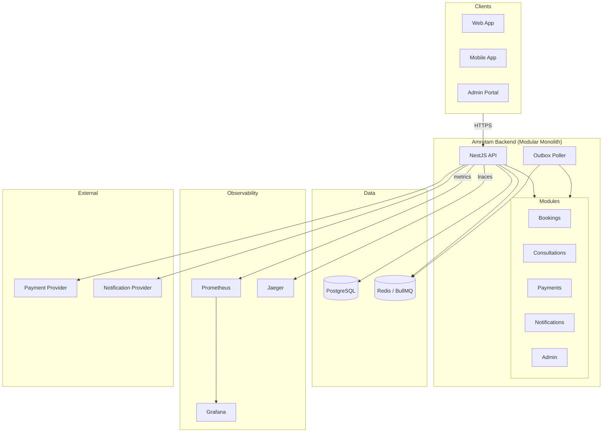
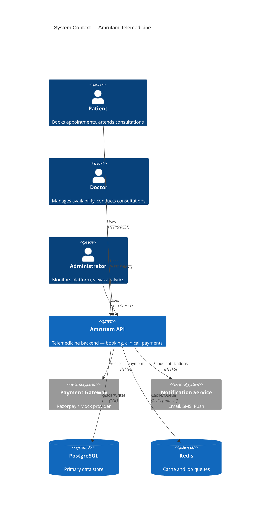
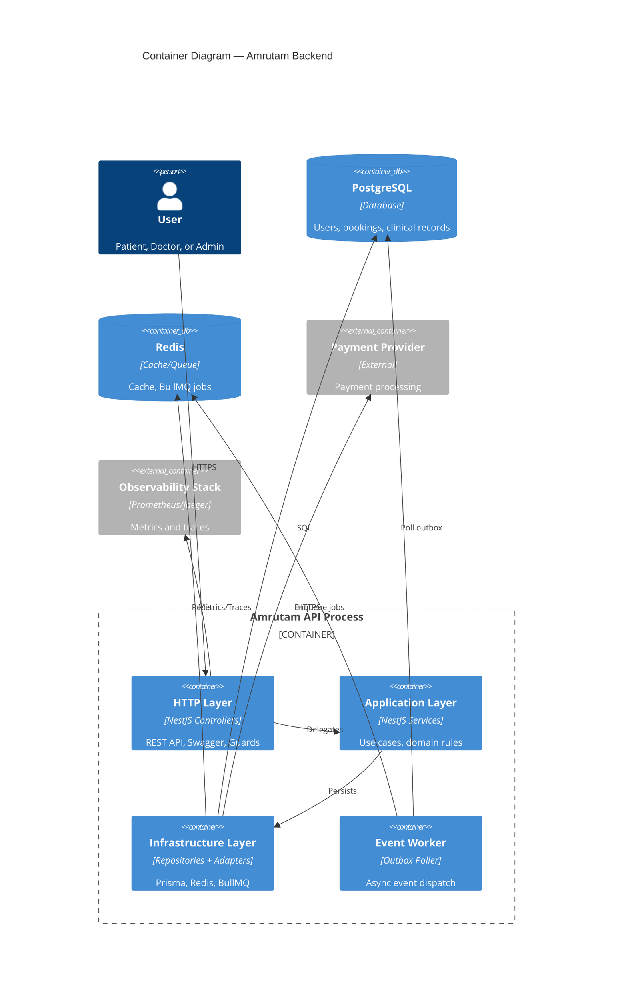
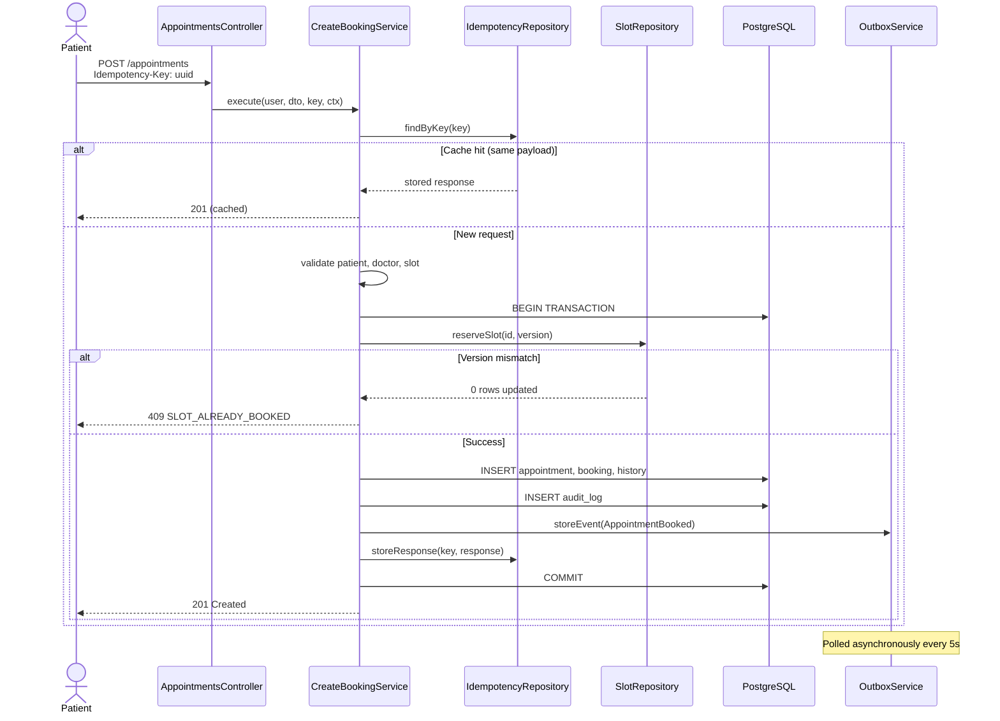
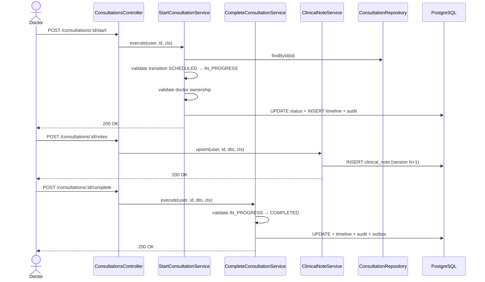
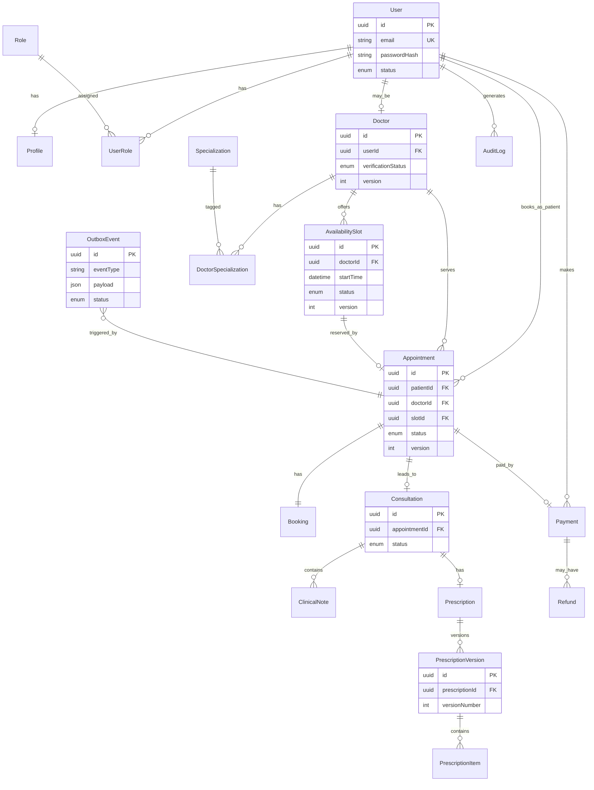
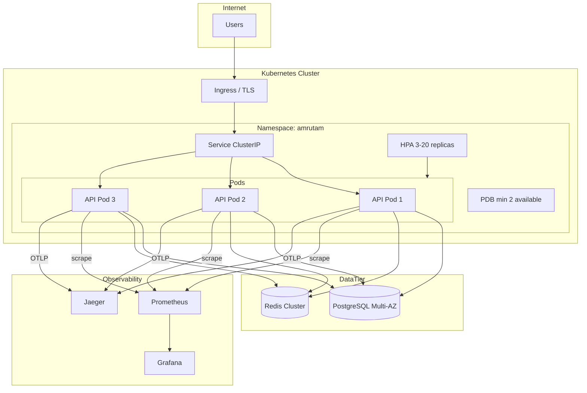
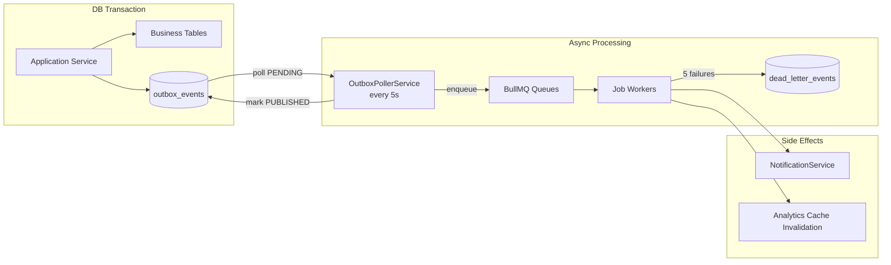
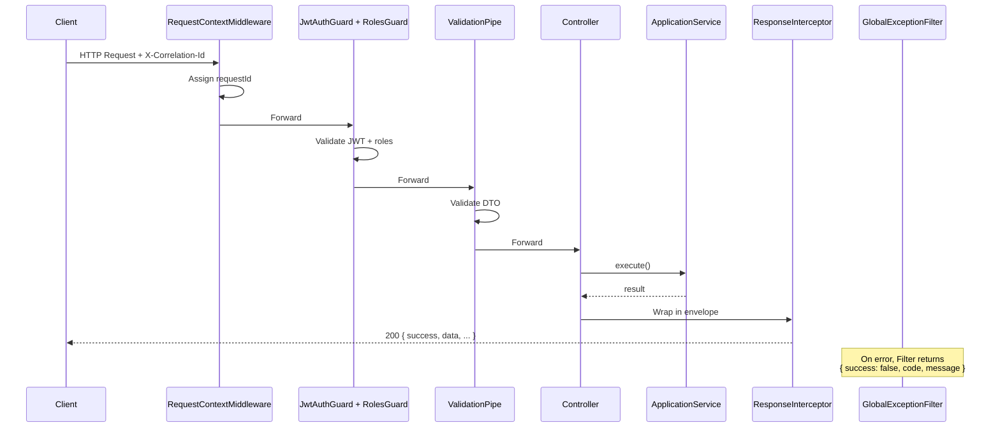
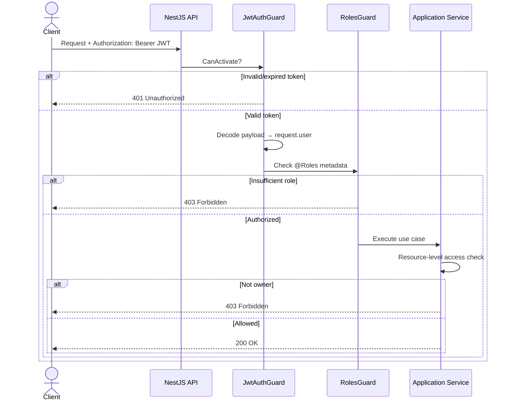

# System Diagrams

All diagrams use [Mermaid](https://mermaid.js.org/). Render in GitHub, VS Code, or any Mermaid-compatible viewer.

---

## High-Level Architecture

---

## C4 Context Diagram

---

## C4 Container Diagram

---

## Booking Sequence Diagram

---

## Consultation Sequence Diagram

---

## Entity Relationship Diagram

Core domain entities (simplified — full schema has 39 models):

---

## Deployment Diagram

---

## Queue / Event Flow Diagram

---

## Request Lifecycle

---

## Authentication Flow

