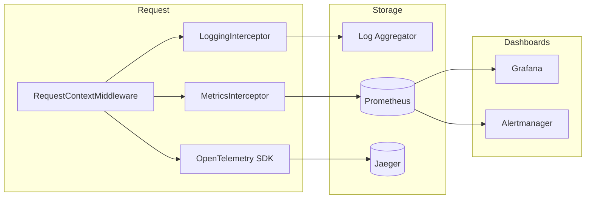

# Observability Guide

Logging, metrics, tracing, health checks, dashboards, and production monitoring for the Amrutam Telemedicine Backend.

---

## Overview

Observability follows the **three pillars** — logs, metrics, traces — with correlation IDs tying them together across HTTP requests, database transactions, outbox events, and BullMQ jobs.



| Pillar | Technology | Access |
|--------|------------|--------|
| Logs | Winston (JSON) | Container stdout → ELK / CloudWatch / Loki |
| Metrics | Prometheus (`prom-client`) | `GET /api/v1/metrics` |
| Traces | OpenTelemetry → OTLP HTTP | Jaeger UI |
| Health | NestJS Terminus | `/api/v1/health/*` |

---

## Correlation IDs

Every HTTP request receives stable identifiers via `RequestContextMiddleware` (`src/middlewares/request-context.middleware.ts`):

| Header | Purpose |
|--------|---------|
| `X-Request-Id` | Unique per HTTP request (generated if absent) |
| `X-Correlation-Id` | Business trace across services (defaults to request ID) |

Both are:

1. Stored on `req.requestContext`
2. Echoed in response headers
3. Propagated through `AsyncLocalStorage` (`src/common/context/correlation.context.ts`)
4. Included in Winston log entries
5. Passed to audit logs and BullMQ job payloads
6. Restored in workers via `runWithCorrelationAsync()`

**Client usage:** Send `X-Correlation-Id` from mobile/web clients to trace a booking attempt from API → notification delivery.

**Incident investigation:** Search logs and Jaeger by correlation ID; query `audit_logs` with the same value.

---

## Logging

### Implementation

| Component | File |
|-----------|------|
| Winston factory | `src/logger/winston.config.ts` |
| Log entry builder | `src/logger/log-formatter.ts` |
| HTTP request logging | `src/interceptors/logging.interceptor.ts` |
| PHI masking | `src/common/utils/masking.util.ts` |

### Format

Production logs are **structured JSON** with consistent fields:

```json
{
  "level": "info",
  "message": "HTTP request completed",
  "requestId": "550e8400-e29b-41d4-a716-446655440000",
  "correlationId": "550e8400-e29b-41d4-a716-446655440000",
  "userId": "3fa85f64-5717-4562-b3fc-2c963f66afa6",
  "module": "AppointmentsController",
  "method": "POST",
  "route": "/api/v1/appointments",
  "statusCode": 201,
  "executionTimeMs": 142,
  "timestamp": "2026-07-10T12:00:00.000Z"
}
```

### PHI protection

`sanitizeForLog()` redacts before emission:

- Email, phone, password fields
- Clinical fields (diagnosis, symptoms) when nested in metadata

Unit tests: `test/unit/masking.spec.ts`

### Slow requests

Requests exceeding `SLOW_REQUEST_THRESHOLD_MS` (default 1000ms) increment `http_slow_requests_total` and should be logged at `warn` level via the metrics interceptor path.

### What we do not log

- Full JWT tokens or refresh tokens
- Raw webhook bodies with card data
- Unredacted clinical note content

---

## Metrics

### Endpoint

```
GET /api/v1/metrics
Content-Type: text/plain; version=0.0.4
```

Public endpoint (no auth) for Prometheus scraper. Controller: `src/metrics/metrics.controller.ts`.

### Instrumentation

`MetricsService` (`src/metrics/metrics.service.ts`) registers:

| Metric | Type | Labels | Purpose |
|--------|------|--------|---------|
| `http_requests_total` | Counter | method, route, status_code | Request volume |
| `http_request_duration_seconds` | Histogram | method, route, status_code | Latency SLOs |
| `http_errors_total` | Counter | method, route, status_code | 4xx/5xx rate |
| `http_slow_requests_total` | Counter | method, route | Slow request count |
| `db_query_duration_seconds` | Histogram | model, operation | Prisma query time |
| `redis_operation_duration_seconds` | Histogram | operation | Cache latency |
| `cache_hits_total` | Counter | — | Cache effectiveness |
| `cache_misses_total` | Counter | — | Cache miss rate |
| `queue_jobs_waiting` | Gauge | queue | Backlog depth |
| `queue_job_duration_seconds` | Histogram | queue, job | Worker processing time |
| `queue_failures_total` | Counter | queue | Failed jobs |

`MetricsInterceptor` records HTTP metrics on every request. `CacheService` records Redis and cache hit/miss metrics.

Default process metrics (CPU, memory) via `collectDefaultMetrics()`.

### Local Prometheus

Docker Compose includes Prometheus scraping the API:

```yaml
# docker/prometheus.yml
scrape_configs:
  - job_name: amrutam-api
    metrics_path: /api/v1/metrics
    static_configs:
      - targets: ['api:3000']
```

UI: http://localhost:9090

### Useful PromQL queries

```promql
# Error rate (5xx)
sum(rate(http_requests_total{status_code=~"5.."}[5m]))
  / sum(rate(http_requests_total[5m]))

# p95 latency
histogram_quantile(0.95, sum(rate(http_request_duration_seconds_bucket[5m])) by (le))

# Cache hit ratio
sum(rate(cache_hits_total[5m]))
  / (sum(rate(cache_hits_total[5m])) + sum(rate(cache_misses_total[5m])))

# Queue backlog
sum(queue_jobs_waiting) by (queue)
```

---

## Tracing

### OpenTelemetry setup

`TracingService` (`src/telemetry/tracing.service.ts`) initializes the Node SDK on module init when `OTEL_ENABLED=true`.

| Setting | Env variable | Default |
|---------|--------------|---------|
| Enable tracing | `OTEL_ENABLED` | `true` |
| OTLP endpoint | `OTEL_EXPORTER_OTLP_ENDPOINT` | `http://localhost:4318/v1/traces` |
| Service name | `SERVICE_NAME` | `amrutam-backend` |
| Service version | `APP_VERSION` | `1.0.0` |

### Auto-instrumentation

Enabled instrumentations:

- `@opentelemetry/instrumentation-http`
- `@opentelemetry/instrumentation-express`
- `@opentelemetry/instrumentation-ioredis`

Spans export via **OTLP HTTP** to Jaeger (or any OTLP-compatible backend).

### Local Jaeger

```bash
docker compose -f docker/docker-compose.yml up -d jaeger
```

UI: http://localhost:16686 — search by service `amrutam-backend` or correlation ID tag.

### Graceful shutdown

`TracingService.shutdown()` flushes pending spans on `SIGTERM` via `ShutdownService`.

---

## Prometheus & Grafana

### Docker stack

```bash
docker compose -f docker/docker-compose.yml up -d prometheus grafana jaeger api
```

| Tool | URL | Credentials |
|------|-----|-------------|
| Prometheus | http://localhost:9090 | — |
| Grafana | http://localhost:3001 | admin / admin (dev) |
| Jaeger | http://localhost:16686 | — |

### Grafana setup (local)

1. Open Grafana → **Connections** → **Data sources** → Add **Prometheus**
2. URL: `http://prometheus:9090` (inside Docker network) or `http://localhost:9090`
3. Create dashboards for:
   - Request rate and error rate
   - p50/p95/p99 latency
   - Cache hit ratio
   - Queue depth and job failures
   - DB query duration

Pre-built dashboard JSON is not committed — import standard **NestJS / Node.js** dashboards or build from PromQL above.

---

## Health Checks

`HealthController` (`src/health/health.controller.ts`) uses `@nestjs/terminus`.

| Endpoint | K8s probe | Checks | Pass criteria |
|----------|-----------|--------|---------------|
| `GET /api/v1/health/live` | Liveness | Memory heap | Process responsive |
| `GET /api/v1/health/ready` | Readiness | PostgreSQL, Redis, BullMQ queue | Can accept traffic |
| `GET /api/v1/health` | Manual / monitoring | All above + disk | Full system status |

### Kubernetes integration

From `infra/k8s/deployment.yaml`:

- **Liveness:** `/api/v1/health/live` — restart pod if process hung
- **Readiness:** `/api/v1/health/ready` — remove from load balancer if DB/Redis down
- **preStop hook:** 15s sleep for connection drain before SIGTERM

### Admin system health

`GET /api/v1/admin/system-health` returns DB connectivity and DLQ/outbox queue metrics for ops dashboards (requires Admin role).

---

## Alerting Strategy

### Recommended alerts (production)

| Alert | Condition | Severity | Action |
|-------|-----------|----------|--------|
| **HighErrorRate** | 5xx > 1% for 5 min | P1 | Page on-call; check recent deploy |
| **HighLatency** | p95 > 2s for 5 min | P2 | Check DB slow queries, cache miss spike |
| **ReadinessFailing** | `/health/ready` non-200 for 2 min | P1 | Check Postgres/Redis connectivity |
| **QueueBacklog** | `queue_jobs_waiting` > 1000 for 10 min | P2 | Scale workers; check notification provider |
| **DLQGrowth** | `queue_failures_total` rate increasing | P2 | Inspect dead-letter table; replay after fix |
| **DiskSpaceLow** | Node disk < 15% | P2 | Expand volume; rotate logs |
| **CertificateExpiry** | TLS cert < 14 days | P3 | Renew ingress certificate |

### Alert routing

```
Prometheus → Alertmanager → PagerDuty / Slack
Grafana → Contact points → Slack (#amrutam-alerts)
```

### Runbook linkage

Each alert should link to [RUNBOOK.md](./RUNBOOK.md) sections:

- Database connection failures → RUNBOOK § Database
- Queue backlog → RUNBOOK § BullMQ / DLQ replay
- High latency → RUNBOOK § Performance troubleshooting

---

## Monitoring in Production

### Day-1 checklist

1. **Scrape metrics** — Prometheus ServiceMonitor or static config targeting `/api/v1/metrics`
2. **Ship logs** — JSON stdout → centralized aggregator with `correlationId` indexed
3. **Enable tracing** — `OTEL_ENABLED=true`, OTLP endpoint to Jaeger/Tempo/Datadog
4. **Configure probes** — liveness + readiness as documented above
5. **Set alerts** — minimum: error rate, readiness, queue depth
6. **Dashboard** — request rate, latency percentiles, cache hit ratio, DB time

### SLO targets

| SLI | Target | Measurement |
|-----|--------|-------------|
| Availability | 99.9% | Readiness probe uptime |
| Read latency (p95) | < 200ms | `http_request_duration_seconds` for GET |
| Write latency (p95) | < 500ms | POST/PATCH booking endpoints |
| Error rate | < 0.1% | 5xx / total requests |

Load test validation: `loadtests/scenarios/` — run against staging before GA.

### Incident workflow

1. **Detect** — Alert fires or user report
2. **Correlate** — Find `correlationId` from client or audit log
3. **Trace** — Jaeger trace for full request path
4. **Logs** — Filter by `correlationId` in log aggregator
5. **Metrics** — Check error rate spike, queue depth, DB latency at incident time
6. **Audit** — `GET /api/v1/admin/audit?fromDate=...` for security events
7. **Remediate** — Rollback, scale, or fix per RUNBOOK

### Environment variables (observability)

| Variable | Purpose |
|----------|---------|
| `OTEL_ENABLED` | Enable/disable tracing |
| `OTEL_EXPORTER_OTLP_ENDPOINT` | Trace export URL |
| `METRICS_ENABLED` | Metrics collection toggle |
| `SLOW_REQUEST_THRESHOLD_MS` | Slow request counter threshold |
| `SLOW_QUERY_THRESHOLD_MS` | DB slow query logging |
| `MAX_HEAP_USED_MB` | Memory health check limit |

See [`.env.example`](../.env.example).

---

## Related Documents

- [ARCHITECTURE.md](./ARCHITECTURE.md) — Observability in system design
- [RUNBOOK.md](./RUNBOOK.md) — Operational procedures
- [SECURITY.md](../SECURITY.md) — Log masking and audit strategy
- [TESTING.md](./TESTING.md) — Metrics and masking unit tests

---

*Last updated: 2026-07-10*
